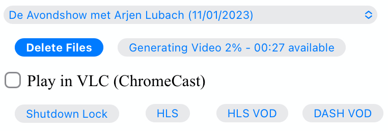
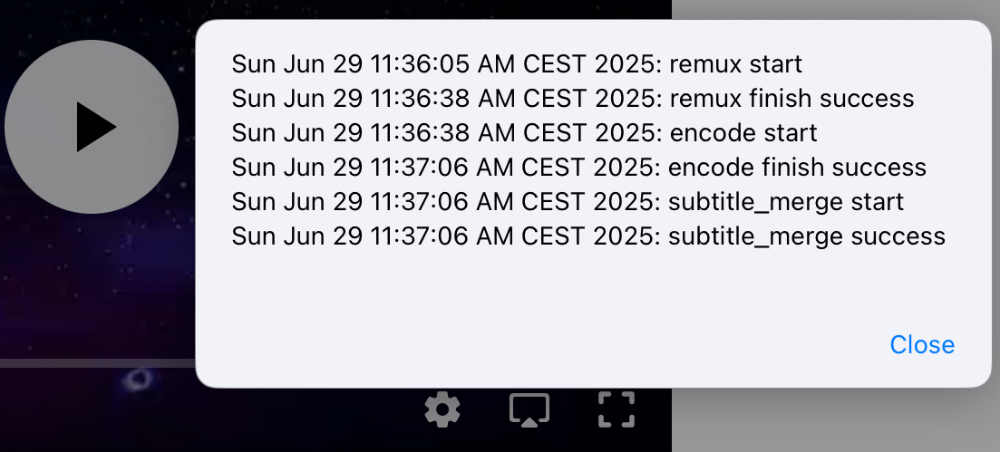
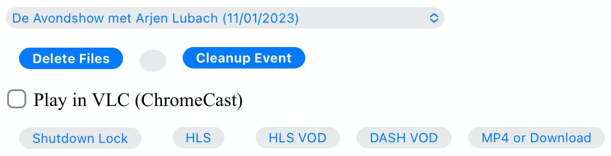

# Description

HTTP Live streaming and DASH support for
[MythTV](https://www.mythtv.org).

Why:

- Although support was added for HTTP Live Streaming (`HLS`) to
  [MythTV](https://www.mythtv.org) in v0.25 it is not yet usable.
- [MythWeb](https://www.mythtv.org/wiki/MythWeb) is no longer actively
  developed and is based on Flash technology from the days of yore.
- HTML5 support for
  [WebFrontend](https://www.mythtv.org/wiki/WebFrontend) is work in
  progress.
- The new [Web Application](https://www.mythtv.org/wiki/Web_Application)
  (MythTV v34) interface does not yet provide HTTP streaming support.
- An attempt to provide streaming support was made in github project
  [MythTV stream mpeg
  DASH](https://github.com/thecount2a/mythtv-stream-mpeg-dash).
- All lack support for `HLS`, Adaptive Bitrate Streaming (`ABR`), live
  recording, live broadcast, subtitles, etcetera.

What:

- Support for HTTP based streaming (serving) of HDHomeRun, MythTV and
  MythVideo content.
- Support for device independent viewing: web browser—mobile, desktop,
  tablet, etc.
- Support for less reliable networks (e.g. cell phone browser).
- Support for live tv, live recording, video and recorded content.
- Support for offline viewing.
- Support for at most one (text based) subtitle stream.
- Support for multiple audio streams in MythVideo.
- Support for MythTV cutlist (commercial cut) created using
  Mythfrontend.

How:

- Encode MythTV recordings and MythVideo content providing playlist
  types `live`, `event` and `VOD`.
- MPEG-DASH and HLS with fragmented MP4 (fMP4) makes both compatible,
  therefore only the manifest file (playlist) is different.
- Transcode to `MP4` for offline playback on mobile devices.
- Video is codified in H.264 format and audio in AAC.
- HW accelerated support for VAAPI (other hw acceleration options are
  untested).
- Simple browser UI.
- Transcode videos to user defined (UI select dropdown list) renditions
  for adaptive playback.
- Configure your preferred languages.
- Optionally a ramdisk can be used for in memory handling of playlist
  type `live`.
- Optionally shutdown lock can be used to prevent MythWelcome from
  shutting down.

# Installation

The installation below is based on Fedora and Apache as web server.
Adapting the code to your distribution / web server is left as an
exercise to the user.

Note: do not run the code as is in an untrusted environment and do not
open your web server to the internet. In either case additional security
measures should be taken. Use at your own risk.

## Dependency

- MythTV
  - Basically any version can be used. Only version v0.34 provides the
    full functionality via the new [Web
    Application](https://www.mythtv.org/wiki/Web_Application) UI.
- FFmpeg (for encoding)[^1]
  - FFmpeg version 5.1.3
- GNU screen
  - This is to allow monitoring of encoding and to support background
    processes launched by the web-facing PHP script.
  - version 4.9.0
- Shaka player
  - This is used as the built-in Javascript-based browser player.
  - version 4.3.6
- Mediainfo
  - Used to loopup technical information about media files.
  - version 23.09
- HDHomeRun
  - Firmware Version 20230713

## Install dependencies

``` shell
sudo dnf install mythtv ffmpeg screen mediainfo inotify-tools hdhomerun-devel sed mediainfo libva-utils intel-mediasdk mesa-va-drivers
```

## Create apache user

Create a web content owner[^2]:

``` shell
sudo useradd -d /var/www/ -g apache -M -N -s /sbin/nologin apache
sudo chown -R apache:apache /var/www/html
sudo chmod -R 755 /var/www/html
```

## Configure sudo

The backend code generates `bash` scripts. The commands in the scripts
should be run as a web content owner user, e.g. `apache`[^3], using
`sudo`.

``` shell
sudo cat /etc/sudoers.d/apache
apache ALL=(ALL) NOPASSWD: /usr/bin/hdhomerun_config, /usr/bin/ffmpeg, /usr/bin/realpath, /usr/bin/sed, /usr/bin/tail, /usr/bin/chmod, /usr/bin/mediainfo, /usr/bin/screen, /usr/bin/echo, /usr/bin/mkdir, /usr/bin/bash, /usr/bin/awk
```

Fill the content of a web content owner, e.g. `apache`,file as shown
above.

``` shell
sudo visudo -f /etc/sudoers.d/apache
```

## Install Shaka-player

``` shell
git clone https://github.com/shaka-project/shaka-player.git
cd shaka-player
python build/all.py
sudo mkdir /var/www/html/dist
sudo chown apache:apache /var/www/html/dist
sudo -uapache rsync -avh dist/ /var/www/html/dist/
```

## Install mythtv-stream-hls-dash

``` shell
git clone https://github.com/alders/mythtv-stream-hls-dash.git
sudo mkdir /var/www/html/mythtv-stream-hls-dash
sudo chown apache:apache /var/www/html/mythtv-stream-hls-dash
sudo -uapache rsync -avnh --exclude='.git/' mythtv-stream-hls-dash/*.php /var/www/html/mythtv-stream-hls-dash/
```

## Patch MythWeb

Optional step, modify 2 lines of
[MythWeb](https://www.mythtv.org/wiki/MythWeb) code to change ASX Stream
button on the "Recorded Programs" page to `Stream HLS DASH` button.

<details>
<summary>
Click me to configure MythWeb.
</summary>

``` shell
diff --git a/modules/tv/tmpl/default/recorded.php b/modules/tv/tmpl/default/recorded.php
index 8502305b..7bf3db0b 100644
--- a/modules/tv/tmpl/default/recorded.php
+++ b/modules/tv/tmpl/default/recorded.php
@@ -158,8 +158,8 @@ EOM;
             echo ' -noimg">';
 ?>
         <a class="x-download"
-            href="<?php echo video_url($show, true) ?>" title="<?php echo t('ASX Stream'); ?>"
-            >/img/play_sm.png" alt="<?php echo t('ASX Stream'); ?>"></a>
+            target="_blank" href="/mythtv-stream-hls-dash/index.php?filename=<?php echo $show->chanid."_".gmdate('YmdHis', $show->recstartts) ?>" title="<?php echo 'Stream HLS DASH'; ?>"
+            >/img/play_sm.png" alt="<?php echo 'Stream HLS DASH'; ?>"></a>
         <a class="x-download"
             href="<?php echo $show->url ?>" title="<?php echo t('Direct Download'); ?>"
             >/img/video_sm.png" alt="<?php echo t('Direct Download'); ?>"></a>
```

</details>

## Patch Web Application

Optionally change a few lines in the [Web
Application](https://www.mythtv.org/wiki/Web_Application)[^4] to allow
recording and / or video and / or live tv selection from your browser.
Replace `yourserver` in the patches below to point to your combined web
server / `Mythbackend` address.

<details>
<summary>
Click me to configure web browser recording selection for playback on any device.
</summary>

``` shell
diff --git a/mythtv/html/backend/src/app/dashboard/recordings/recordings.component.html b/mythtv/html/backend/src/app/dashboard/recordings/recordings.component.html
index 4618e41aa8..8bae11e03a 100644
--- a/mythtv/html/backend/src/app/dashboard/recordings/recordings.component.html
+++ b/mythtv/html/backend/src/app/dashboard/recordings/recordings.component.html
@@ -76,7 +76,8 @@
                     <td style="flex-basis: 12%" class="p-1 overflow-hidden">
                         <i class="pi pi-exclamation-triangle p-1" *ngIf="program.VideoPropNames.indexOf('DAMAGED') > -1"
                             pTooltip="{{ 'dashboard.recordings.damaged' | translate }}" tooltipPosition="top"></i>
-                        {{program.Title}}
+                       <a href="{{URLencode('http://yourserver/mythtv-stream-hls-dash/index.php?filename=' + program.Recording.FileName.split('.').slice(0, -1).join('.'))}}" target="_blank">{{program.Title}}</a></td>
+
                     </td>
                     <td style="flex-basis: 2%" class="p-1">
                         <i class="pi pi-eye" *ngIf="program.ProgramFlagNames.indexOf('WATCHED') > -1"
```

</details>

<details>
<summary>
Click me to configure web browser video selection for playback on any device.
</summary>

``` shell
diff --git a/mythtv/html/backend/src/app/dashboard/videos/videos.component.html b/mythtv/html/backend/src/app/dashboard/videos/videos.component.html
index 2d75b5e0ab..42abea28ac 100644
--- a/mythtv/html/backend/src/app/dashboard/videos/videos.component.html
+++ b/mythtv/html/backend/src/app/dashboard/videos/videos.component.html
@@ -68,7 +68,7 @@
                                 (click)="onDirectory(video.Title)" label="{{video.Title}}"></button>
                         </div>
                         <ng-template #title>
-                            {{video.Title}}
+                            <a href="{{URLencode('http://yourserver/mythtv-stream-hls-dash/index.php?videoid=' + video.Id)}}" target="_blank">{{video.Title}}</a>
                         </ng-template>
                     </td>
                     <td style="flex-basis: 3%" class="p-1">
```

</details>

<details>
<summary>
Click me to configure web browser tv channel selection for playback on any device.
</summary>

``` shell
diff --git a/mythtv/html/backend/src/app/guide/components/channelicon/channelicon.component.html b/mythtv/html/backend/src/app/guide/components/channelicon/channelicon.component.html
index 44abe96fea..c17429ef6c 100644
--- a/mythtv/html/backend/src/app/guide/components/channelicon/channelicon.component.html
+++ b/mythtv/html/backend/src/app/guide/components/channelicon/channelicon.component.html
@@ -4,6 +4,6 @@
         <ng-template #nullIcon></ng-template>
     </div>
     <div class="channelText">
-        <span>{{ channel.ChanNum}} {{ channel.CallSign }}</span>
+        <span><a href="{{URLencode('http://yourserver/mythtv-stream-hls-dash/hdhomerunstream.php?quality[]=high480&hw=h264&channel=' + channel.CallSign + '&do=Watch+TV')}}" target="_blank">{{channel.ChanNum}} {{ channel.CallSign }}</a></span>
     </div>
</div>
diff --git a/mythtv/html/backend/src/app/guide/components/channelicon/channelicon.component.ts b/mythtv/html/backend/src/app/guide/components/channelicon/channelicon.component.ts
index 97ae71efa8..f088012f94 100644
--- a/mythtv/html/backend/src/app/guide/components/channelicon/channelicon.component.ts
+++ b/mythtv/html/backend/src/app/guide/components/channelicon/channelicon.component.ts
@@ -16,4 +16,8 @@ export class ChannelIconComponent implements OnInit {
   ngOnInit(): void {
   }

+  URLencode(x: string): string {
+      let trimmed = x.replace(/\s+/g, '');
+      return encodeURI(trimmed);
+  }
 }
```

</details>

To apply these optional [Web
Application](https://www.mythtv.org/wiki/Web_Application) changes run
the npm build script and install the web application.

<details>
<summary>
Click me to run the npm build script.
</summary>

``` shell
cd mythtv/mythtv/html/backend/
npm run-script build
cd ..
sudo make install
```

</details>

## In memory processing

Optional step, add these (or similar) lines depending on your
installation to `/etc/fstab` to create a ramdisk for playlist `live` and
`channel`.

<details>
<summary>
Click me to configure a ramdisk
</summary>

``` shell
tmpfs                                           /var/www/html/live tmpfs nodev,nosuid,noexec,nodiratime,size=200M 0  0
tmpfs                                           /var/www/html/channel tmpfs nodev,nosuid,nodiratime,size=200M 0  0
```

</details>

## Additional configuration

Required configuration:

- \$webroot – This is the root of your web server.
- \$webuser – This is the web content run user.
- \$xml – Make sure your MythTV
  [Config.xml](https://www.mythtv.org/wiki/Config.xml) is readable by
  `$webuser`.
- \$sublangpref – This array contains your preferred languages in order.
  If available, the first match from top to bottom will be used as
  subtitle.

Optional configuration:

- \$hlsdir – This is the directory where the meta data of all encoded
  videos are stored. Moreover playlist `event` videos are stored here.
- \$livedir – This is the directory where playlist `live` videos are
  stored.
- \$voddir – This is the directory where playlist `vod` videos are
  stored.
- \$ffmpeg – This variable points to the `FFmpeg` executable. One may
  point to this variable to `mythffmpeg`, but subtitles handling is not
  supported.
- \$hwaccels – This array specifies the hw acceleration options for
  `FFmpeg`. Note: only `h264` and `nohwaccel` has been tested.
- \$settings – This array specifies the ladder the user may choose for
  his renditions.

## Allow JavaScript

Allow JavaScript in your browser.

# HTTP streaming

## Example

### User interface

Figure 1 shows the user interface of `mythtv-stream-hls-dash` after
selecting a recording in [MythWeb](https://www.mythtv.org/wiki/MythWeb)
or the new [Web
Application](https://www.mythtv.org/wiki/Web_Application)[^5].

In case you do not want to patch
[MythWeb](https://www.mythtv.org/wiki/MythWeb) and the new [Web
Application](https://www.mythtv.org/wiki/Web_Application) find the
filename in your recording directory, remove the extension from the
filename and browse to
<http://yourserver/mythtv-stream-hls-dash/index.php?filename=NNNN_NNNNNNNNNNNNNN>.
For video extract the videoid from the download link in [Web
Application](https://www.mythtv.org/wiki/Web_Application) and browse to
<http://yourserver/mythtv-stream-hls-dash/video.php?videoid=NNNN>.

**Figure 1:** *User interface.*


User interface options from top to bottom:

- Select an available recording from the list box[^6].
- Select the `ABR` renditions from the select dropdown list box.
- Select the HW acceleration from the list box[^7].
- Select if the `Cutlist` should be used using the list box[^8].
- Select using the checkbox if `Subtitles` should be created[^9].
- Select using the checkboxes if playlist type `live` or `event` should
  be used[^10].
- Select using the checkbox if playlist type `VOD` should be used.
- Select using the checkbox if a `MP4` file should be created.
- Press **Encode Video** when you are satisfied with your choices to
  start encoding.

The selections shown in Figure 1 are used in the descriptions below as a
running example.

Though not shown here, the user interface after selecting a video
instead of a recording from [Web
Application](https://www.mythtv.org/wiki/Web_Application) has the same
look and feel. Most functionality for a video and a recording is
overlapping, but there are distinct differences as well. For example
commercial cut is only available for recordings not for video. On the
contrary multiple audio streams are only supported for video not for
recordings.

### Adaptive Bitrate Streaming

Figure 2 shows in more detail the user interface (phone interface) to
select the renditions for Adaptive Bitrate Streaming (ABR). Use
Ctrl-Click (Windows), Command-Click (Apple) to select the renditions.

**Figure 2:** *Adaptive Bitrate UI.*


### Remuxing

This remux step is performed when the [commercials are manually
cut](https://www.mythtv.org/wiki/Editing_Recordings) in `mythfrontend`.
Remuxing may also be required when otherwise the input video format
cannot be processed (e.g. `avi`).

Figure 3 shows the user interface while remuxing. Because
`Cut Commercials` was selected in Figure 1, the video is remuxed to an
`MP4` container.

**Figure 3:** *Remuxing UI.*


Three buttons are shown below the available recording list box.

The first button `Delete Video Files` basically does what is says[^11].

The second status button displays a dynamic message. Figure 3 shows the
`Remuxing
Video` percentage.

The third button `Shutdown Lock` can be used to prevent
[MythWelcome](https://www.mythtv.org/wiki/index.php/Mythwelcome) from
shutting down. In combination with Wake-On-Lan (WOL) configured on your
`mythbackend` machine this allows one to have full control from your
browser.

### Generating video

Figure 4 shows the user interface while encoding the video.

**Figure 4:** *Generating video.*



Progress of the encoding is shown on the status button as a percentage
and the time of the video available. When there is about 6 seconds of
video available the player automatically tries to load the video[^12].

At the right hand side of the `Shutdown Lock` button additional buttons
dynamically appear when files become available on disk. In Figure 4 this
is the case for `HLS event,` `HLS VOD`, and `DASH VOD`. The video should
load automagically within 30 seconds. If this does not happen, select
either of the buttons to start playing. As a last resort one could
reload the web page.

Old devices not supporting the Shaka video player of the UI, may still
be able to play media through the buttons provided. The buttons link to
the various manifest files. The http links can also be copied and used
in your favorite app.

### Status button

Figure 5 shows what happens in case the status button is selected. This
will trigger a popup message box with a detailed view of the steps
involved and the status thereof.

In this example three processing steps were required:

1.  Remux to `mp4` container for commercial cut.
2.  Encoding to the various playlists.
3.  Subtitle merge into the `mp4` file.

**Figure 5:** *Status UI.*



### User interface after encoding

Figure 6 shows the interface after encoding is done.

**Figure 6:** *User interface after encoding.*



Two additional buttons appeared in Figure 6, `Cleanup Video Files` [^13]
and `Download MP4`.

Since both playlists `HLS event` and `HLS VOD` basically provide similar
user experience for HLS one may decide to remove the playlist
`HLS event` files to reduce disk space. This is exactly what the
`Cleanup Video Files` button does.

The UI also shows a `Download MP4` link as was requested in Figure 1.
The latter is only visible when the encoding has finished and optionally
subtitles are mixed in.

## Generated script

After pressing the `Encode Video` in Figure 1 a `bash` shell script is
generated. For illustration purposes the code for the running example is
shown in separate code blocks below.

### Remuxing

The user in Figure 1 selected `Cut Commercials`. This requires the input
video to be remuxed to a `MP4` container as shown in the user interface
of Figure 3. The code block below shows in detail how this is done.

An `MP4` container allows FFmpeg to use the `concat demuxer` later in
the script[^14].

<details>
<summary>
Click me
</summary>

``` shell
cd /var/www/html/hls/10100_20231101212100
/usr/bin/sudo /usr/bin/screen -S 10100_20231101212100_remux -dm /usr/bin/sudo -uapache /usr/bin/bash -c '/usr/bin/echo `date`: remux start > /var/www/html/hls/10100_20231101212100/status.txt;
/usr/bin/sudo -uapache /usr/bin/ffmpeg \
          -y \
          -hwaccel vaapi -vaapi_device /dev/dri/renderD128 \  # Use VAAPI Hardware acceleration
          -txt_format text -txt_page 888 \                    # extract subtitles from dvb_teletext
          -fix_sub_duration \                                 # avoid overlap of subtitles
          -i /mnt/mythtv2/store//10100_20231101212100.ts \    # input file recorded with HDHomeRun
          -c copy \                                           # use encoder copy for video and audio
          -c:s mov_text \                                     # set subtitle codec to mov_text
          /var/www/html/hls/10100_20231101212100/video.mp4 && \
/usr/bin/echo `date`: remux finish success >> /var/www/html/hls/10100_20231101212100/status.txt || \
/usr/bin/echo `date`: remux finish failed >> /var/www/html/hls/10100_20231101212100/status.txt'
while [ ! "`/usr/bin/cat /var/www/html/hls/10100_20231101212100/status.txt | /usr/bin/grep 'remux finish success'`" ] ; \
do \
    sleep 1; \
done
(while [ ! -f "/var/www/html/hls/10100_20231101212100/master_event.m3u8" ] ;
 do
        /usr/bin/inotifywait -e close_write --include "master_event.m3u8"  /var/www/html/hls/10100_20231101212100;
 done;
```

</details>

### Adapt playlist `master_event.m3u8` file

Adapt the playlist `master_event.m3u8` as soon as the file is created by
FFmpeg some time in the future. This allows the handling of subtitles
and the player to start at the beginning of the video.

<details>
<summary>
Click me
</summary>

``` shell
(while [ ! -f "/var/www/html/hls/10100_20231101212100/master_event.m3u8" ] ;
 do
        /usr/bin/inotifywait -e close_write --include "master_event.m3u8"  /var/www/html/hls/10100_20231101212100;
 done;
    /usr/bin/sudo -uapache /usr/bin/sed -i -E 's/(#EXT-X-VERSION:7)/\1\n#EXT-X-MEDIA:TYPE=SUBTITLES,GROUP-ID="subtitles",NAME="Dutch",DEFAULT=YES,FORCED=NO,AUTOSELECT=YES,URI="sub_0_vtt.m3u8",LANGUAGE="dut"/' /var/www/html/hls/10100_20231101212100/master_event.m3u8;
    /usr/bin/sudo -uapache /usr/bin/sed -i -E 's/(#EXT-X-VERSION:7)/\1\n#EXT-X-START:TIME-OFFSET=0/' /var/www/html/hls/10100_20231101212100/master_event.m3u8;
    /usr/bin/sudo -uapache /usr/bin/sed -i -E 's/(#EXT-X-STREAM.*)/\1,SUBTITLES="subtitles"/'  /var/www/html/hls/10100_20231101212100/master_event.m3u8; /usr/bin/sudo -uapache /usr/bin/sudo sed -r '/(#EXT-X-STREAM-INF:BANDWIDTH=[0-9]+\,CODECS)/{N;d;}' -i /var/www/html/hls/10100_20231101212100/master_event.m3u8;) &
```

</details>

### Adapt playlist **master_vod.m3u8** file

Adapt the playlist `master_vod.m3u8` file as soon as the file is created
by FFmpeg some time in the future. This allows the handling of subtitles
and the player to start at the beginning of the video. Additionally the
language of the audio is defined.

<details>
<summary>
Click me
</summary>

``` shell
(while [ ! -f "/var/www/html/vod/10100_20231101212100/master_vod.m3u8" ] ;
 do
        /usr/bin/inotifywait -e close_write --include "master_vod.m3u8" /var/www/html/vod/10100_20231101212100;
 done;
    /usr/bin/sudo -uapache /usr/bin/sed -i -E 's/(#EXT-X-VERSION:7)/\1\n#EXT-X-MEDIA:TYPE=SUBTITLES,GROUP-ID="subtitles",NAME="Dutch",DEFAULT=YES,FORCED=NO,AUTOSELECT=YES,URI="sub_0_vtt.m3u8",LANGUAGE="dut"/' /var/www/html/vod/10100_20231101212100/master_vod.m3u8;
    /usr/bin/sudo -uapache /usr/bin/sed -i -E 's/(#EXT-X-VERSION:7)/\1\n#EXT-X-START:TIME-OFFSET=0/' /var/www/html/vod/10100_20231101212100/master_vod.m3u8;
    /usr/bin/sudo -uapache /usr/bin/sed -i -E 's/(#EXT-X-STREAM.*)/\1,SUBTITLES="subtitles"/' /var/www/html/vod/10100_20231101212100/master_vod.m3u8;
    /usr/bin/sudo -uapache /usr/bin/sed -i -E 's/(#EXT-X-MEDIA:TYPE=AUDIO,GROUP-ID="group_A1")/\1,LANGUAGE="dut"/' /var/www/html/vod/10100_20231101212100/master_vod.m3u8;) &
```

</details>

### FFmpeg encoding

The major part of the encoding is done in one FFmpeg command utilizing
`filter_complex` and `tee` to the max. This code block starts the actual
encoding and waits until it is finished.

<details>
<summary>
Click me
</summary>

``` shell
/usr/bin/sudo -uapache /usr/bin/bash -c '/usr/bin/echo `date`: encode start >> /var/www/html/hls/10100_20231101212100/status.txt';
/usr/bin/sudo -uapache /usr/bin/mkdir -p /var/www/html/vod/10100_20231101212100;

/usr/bin/sudo -uapache /usr/bin/mkdir -p /var/www/html/hls/10100_20231101212100;
cd /var/www/html/hls/;
/usr/bin/sudo -uapache /usr/bin/ffmpeg \
    -fix_sub_duration \
    -txt_format text -txt_page 888 \
    -hwaccel vaapi -vaapi_device /dev/dri/renderD128 \
     \
     \
    -f concat -async 1 -safe 0 -i /var/www/html/hls/10100_20231101212100/cutlist.txt \  # Use cutlist
    -progress 10100_20231101212100/progress-log.txt \ # Track progress of encoding
    -live_start_index 0 \                             # Segment index to start live streams at
    -force_key_frames "expr:gte(t,n_forced*2)" \      # Fixed key frame interval is needed to avoid variable segment duration.
    -tune film \                                      # use for high quality movie content; lowers deblocking
    -metadata title="De Avondshow met Arjen Lubach" \
    -force_key_frames "expr:gte(t,n_forced*2)" \
    -filter_complex "[0:v]split=3[v1][v2][v3];[v1]format=nv12|vaapi,hwupload,scale_vaapi=w=1280:h=720[v1out];[v2]format=nv12|vaapi,hwupload,scale_vaapi=w=854:h=480[v2out];[v3]format=nv12|vaapi,hwupload,scale_vaapi=w=640:h=360[v3out]" \
    -map [v1out] -c:v:0 \        # Rendition 1
        h264_vaapi \             # Use H264 VAAPI (Video Acceleration API) hardware acceleration
        -b:v:0 3200k \           # Transcode Video 1 to a user selected bitrate
        -maxrate:v:0 3200k \     # Maximum bitrate
        -bufsize:v:0 1.5*3200k \ # Buffer size
        -crf 23 \                # Constant Rate Factor
        -preset veryslow \       #
        -g 48 \                  #
        -keyint_min 48 \         # Set minimum interval between IDR-frame
        -sc_threshold 0 \        # Sets the threshold for the scene change detection.
        -flags +global_header \  # Set global header in the bitstream.
    -map [v2out] -c:v:1 \        # Rendition 2
        h264_vaapi \             # Use H264 VAAPI (Video Acceleration API) hardware acceleration
        -b:v:1 1600k \           # Transcode Video 2 to a derived lower resolution based on a user selected bitrate
        -maxrate:v:1 1600k \     # Maximum bitrate
        -bufsize:v:1 1.5*1600k \ # Buffer size
        -crf 23 \                # Constant Rate Factor
        -preset veryslow \       #
        -g 48 \                  #
        -keyint_min 48 \         # Set minimum interval between IDR-frame
        -sc_threshold 0 \        # Sets the threshold for the scene change detection.
        -flags +global_header \  # Set global header in the bitstream.
    -map [v3out] -c:v:2 \        # Rendition 3
        h264_vaapi \             # Use H264 VAAPI (Video Acceleration API) hardware acceleration
        -b:v:2 900k \            # Transcode Video 3 to a derived lower resolution based on a user selected bitrate
        -maxrate:v:2 900k \      # Maximum bitrate
        -bufsize:v:2 1.5*900k \  # Buffer size
        -crf 23 \                # Constant Rate Factor
        -preset veryslow \       #
        -g 48 \                  #
        -keyint_min 48 \         # Set minimum interval between IDR-frame
        -sc_threshold 0 \        # Sets the threshold for the scene change detection.
        -flags +global_header \  # Set global header in the bitstream.
 \
    -map a:0 -c:a:0 aac -b:a:0 128k -ac 2 \
        -metadata:s:a:0 language=dut \
 \
    -map 0:s:0 -c:s webvtt -metadata:s:s:0 language=dut \
    -f tee \
        "[select=\'a:0,v:0,v:1,v:2\': \
          f=dash: \
          seg_duration=2: \
          hls_playlist=true: \
          single_file=true: \
          adaptation_sets=\'id=0,streams=a id=1,streams=v\' : \
          media_seg_name=\'stream_vod_$RepresentationID$-$Number%05d$.$ext$\': \
          hls_master_name=master_vod.m3u8]../vod/10100_20231101212100/manifest_vod.mpd| \
         [select=\'v:0,s:0\': \
          strftime=1: \
          hls_flags=+independent_segments+iframes_only: \
          hls_time=2: \
          hls_playlist_type=event: \
          hls_segment_type=fmp4: \
          var_stream_map=\'v:0,s:0,sgroup:subtitle\': \
          hls_segment_filename=\'/dev/null\']../vod/10100_20231101212100/sub_%v.m3u8| \
          [select=\'v:0,a:0\': \
          f=mp4: \
          movflags=+faststart]10100_20231101212100/10100_20231101212100 - De Avondshow met Arjen Lubach.mp4| \
          [select=\'s:0\']10100_20231101212100/subtitles.vtt| \
          /dev/null| \
          [select=\'a:0,v:0,v:1,v:2\': \
          f=hls: \
          hls_time=2: \
          hls_playlist_type=event: \
          hls_flags=+independent_segments+iframes_only: \
          hls_segment_type=fmp4: \
          var_stream_map=\'a:0,agroup:aac,language:dut,name:aac_0_128k v:0,agroup:aac,name:720p_3200 v:1,agroup:aac,name:480p_1600 v:2,agroup:aac,name:360p_900\': \
          master_pl_name=master_event.m3u8: \
          hls_segment_filename=10100_20231101212100/stream_event_%v_data%02d.m4s]10100_20231101212100/stream_event_%v.m3u8| \
         [select=\'v:0,s:0\': \
          strftime=1: \
          f=hls: \
          hls_flags=+independent_segments+program_date_time: \
          hls_time=2: \
          hls_playlist_type=event: \
          hls_segment_type=fmp4: \
          var_stream_map=\'v:0,s:0,sgroup:subtitle\': \
          hls_segment_filename=\'/dev/null\']10100_20231101212100/sub_%v.m3u8" \
2>>/tmp/ffmpeg-hls-10100_20231101212100.log && \
/usr/bin/sudo -uapache /usr/bin/bash -c '/usr/bin/echo `date`: encode finish success >> /var/www/html/hls/10100_20231101212100/status.txt' || \
/usr/bin/sudo -uapache /usr/bin/bash -c '/usr/bin/echo `date`: encode finish failed >> /var/www/html/hls/10100_20231101212100/status.txt'
while [ ! "`/usr/bin/cat /var/www/html/hls/10100_20231101212100/status.txt | /usr/bin/grep 'encode finish success'`" ] ;
do
    sleep 1;
done
```

</details>

### Add subtitles to MP4

In a post-processing step subtitles are added to the `MP4`.

<details>
<summary>
Click me
</summary>

``` shell
cd /var/www/html/hls/10100_20231101212100;
/usr/bin/sudo -uapache /usr/bin/bash -c '/usr/bin/echo `date`: subtitle_merge start >> /var/www/html/hls/10100_20231101212100/status.txt';
cd /var/www/html/hls/10100_20231101212100;
/usr/bin/sudo -uapache /usr/bin/ffmpeg \
    -i "10100_20231101212100 - De Avondshow met Arjen Lubach.mp4" \
    -i subtitles.vtt \
    -c:s mov_text -metadata:s:s:0 language=dut -disposition:s:0 default \
    -c:v copy \
    -c:a copy \
    "10100_20231101212100 - De Avondshow met Arjen Lubach.tmp.mp4" \
2>>/tmp/ffmpeg-subtitle-merge-hls-10100_20231101212100.log && \
/usr/bin/sudo -uapache /usr/bin/bash -c '/usr/bin/echo `date`: subtitle_merge success >> /var/www/html/hls/10100_20231101212100/status.txt' || \
/usr/bin/sudo -uapache /usr/bin/bash -c '/usr/bin/echo `date`: subtitle_merge failed >> /var/www/html/hls/10100_20231101212100/status.txt';
/usr/bin/sudo /usr/bin/mv -f "10100_20231101212100 - De Avondshow met Arjen Lubach.tmp.mp4" "10100_20231101212100 - De Avondshow met Arjen Lubach.mp4"
while [ ! "`/usr/bin/cat /var/www/html/hls/10100_20231101212100/status.txt | /usr/bin/grep 'encode finish success'`" ] ;
do
    sleep 1;
done
/usr/bin/sudo /usr/bin/rm /var/www/html/hls/10100_20231101212100/video.mp4
sleep 3 && /usr/bin/sudo /usr/bin/screen -ls 10100_20231101212100_encode  | /usr/bin/grep -E '\s+[0-9]+.' | /usr/bin/awk '{print $1}' - | while read s; do /usr/bin/sudo /usr/bin/screen -XS $s quit; done
```

</details>

### Complete script

For completeness the whole script.

<details>
<summary>
Click me
</summary>

``` shell
cd /var/www/html/hls/10100_20231101212100
/usr/bin/sudo /usr/bin/screen -S 10100_20231101212100_remux -dm /usr/bin/sudo -uapache /usr/bin/bash -c '/usr/bin/echo `date`: remux start > /var/www/html/hls/10100_20231101212100/status.txt;
/usr/bin/sudo -uapache /usr/bin/ffmpeg \
          -y \
          -hwaccel vaapi -vaapi_device /dev/dri/renderD128 \
          -txt_format text -txt_page 888 \
          -fix_sub_duration \
          -i "/mnt/mythtv2/store//10100_20231101212100.ts" \
          -c copy \
          -c:s mov_text \
          /var/www/html/hls/10100_20231101212100/video.mp4 && \
/usr/bin/echo `date`: remux finish success >> /var/www/html/hls/10100_20231101212100/status.txt || \
/usr/bin/echo `date`: remux finish failed >> /var/www/html/hls/10100_20231101212100/status.txt'
while [ ! "`/usr/bin/cat /var/www/html/hls/10100_20231101212100/status.txt | /usr/bin/grep 'remux finish success'`" ] ; \
do \
    sleep 1; \
done
(while [ ! -f "/var/www/html/hls/10100_20231101212100/master_event.m3u8" ] ;
 do
        /usr/bin/inotifywait -e close_write --include "master_event.m3u8"  /var/www/html/hls/10100_20231101212100;
 done;
    /usr/bin/sudo -uapache /usr/bin/sed -i -E 's/(#EXT-X-VERSION:7)/\1\n#EXT-X-MEDIA:TYPE=SUBTITLES,GROUP-ID="subtitles",NAME="Dutch",DEFAULT=YES,FORCED=NO,AUTOSELECT=YES,URI="sub_0_vtt.m3u8",LANGUAGE="dut"/' /var/www/html/hls/10100_20231101212100/master_event.m3u8;
    /usr/bin/sudo -uapache /usr/bin/sed -i -E 's/(#EXT-X-VERSION:7)/\1\n#EXT-X-START:TIME-OFFSET=0/' /var/www/html/hls/10100_20231101212100/master_event.m3u8;
    /usr/bin/sudo -uapache /usr/bin/sed -i -E 's/(#EXT-X-STREAM.*)/\1,SUBTITLES="subtitles"/'  /var/www/html/hls/10100_20231101212100/master_event.m3u8; /usr/bin/sudo -uapache /usr/bin/sudo sed -r '/(#EXT-X-STREAM-INF:BANDWIDTH=[0-9]+\,CODECS)/{N;d;}' -i /var/www/html/hls/10100_20231101212100/master_event.m3u8;) &
(while [ ! -f "/var/www/html/vod/10100_20231101212100/master_vod.m3u8" ] ;
 do
        /usr/bin/inotifywait -e close_write --include "master_vod.m3u8" /var/www/html/vod/10100_20231101212100;
 done;
    /usr/bin/sudo -uapache /usr/bin/sed -i -E 's/(#EXT-X-VERSION:7)/\1\n#EXT-X-MEDIA:TYPE=SUBTITLES,GROUP-ID="subtitles",NAME="Dutch",DEFAULT=YES,FORCED=NO,AUTOSELECT=YES,URI="sub_0_vtt.m3u8",LANGUAGE="dut"/' /var/www/html/vod/10100_20231101212100/master_vod.m3u8;
    /usr/bin/sudo -uapache /usr/bin/sed -i -E 's/(#EXT-X-VERSION:7)/\1\n#EXT-X-START:TIME-OFFSET=0/' /var/www/html/vod/10100_20231101212100/master_vod.m3u8;
    /usr/bin/sudo -uapache /usr/bin/sed -i -E 's/(#EXT-X-STREAM.*)/\1,SUBTITLES="subtitles"/' /var/www/html/vod/10100_20231101212100/master_vod.m3u8;
    /usr/bin/sudo -uapache /usr/bin/sed -i -E 's/(#EXT-X-MEDIA:TYPE=AUDIO,GROUP-ID="group_A1")/\1,LANGUAGE="dut"/' /var/www/html/vod/10100_20231101212100/master_vod.m3u8;) &
/usr/bin/sudo -uapache /usr/bin/bash -c '/usr/bin/echo `date`: encode start >> /var/www/html/hls/10100_20231101212100/status.txt';
/usr/bin/sudo -uapache /usr/bin/mkdir -p /var/www/html/vod/10100_20231101212100;

/usr/bin/sudo -uapache /usr/bin/mkdir -p /var/www/html/hls/10100_20231101212100;
cd /var/www/html/hls/;
/usr/bin/sudo -uapache /usr/bin/ffmpeg \
    -fix_sub_duration \
    -txt_format text -txt_page 888 \
    -hwaccel vaapi -vaapi_device /dev/dri/renderD128 \
     \
     \
    -f concat -async 1 -safe 0 -i /var/www/html/hls/10100_20231101212100/cutlist.txt \  # Use cutlist
    -progress 10100_20231101212100/progress-log.txt \ # Track progress of encoding
    -live_start_index 0 \                             # Segment index to start live streams at
    -force_key_frames "expr:gte(t,n_forced*2)" \      # Fixed key frame interval is needed to avoid variable segment duration.
    -tune film \                                      # use for high quality movie content; lowers deblocking
    -metadata title="De Avondshow met Arjen Lubach" \
    -force_key_frames "expr:gte(t,n_forced*2)" \
    -filter_complex "[0:v]split=3[v1][v2][v3];[v1]format=nv12|vaapi,hwupload,scale_vaapi=w=1280:h=720[v1out];[v2]format=nv12|vaapi,hwupload,scale_vaapi=w=854:h=480[v2out];[v3]format=nv12|vaapi,hwupload,scale_vaapi=w=640:h=360[v3out]" \
    -map [v1out] -c:v:0 \        # Rendition 1
        h264_vaapi \             # Use H264 VAAPI (Video Acceleration API) hardware acceleration
        -b:v:0 3200k \           # Transcode Video 1 to a user selected bitrate
        -maxrate:v:0 3200k \     # Maximum bitrate
        -bufsize:v:0 1.5*3200k \ # Buffer size
        -crf 23 \                # Constant Rate Factor
        -preset veryslow \       #
        -g 48 \                  #
        -keyint_min 48 \         # Set minimum interval between IDR-frame
        -sc_threshold 0 \        # Sets the threshold for the scene change detection.
        -flags +global_header \  # Set global header in the bitstream.
    -map [v2out] -c:v:1 \        # Rendition 2
        h264_vaapi \             # Use H264 VAAPI (Video Acceleration API) hardware acceleration
        -b:v:1 1600k \           # Transcode Video 2 to a derived lower resolution based on a user selected bitrate
        -maxrate:v:1 1600k \     # Maximum bitrate
        -bufsize:v:1 1.5*1600k \ # Buffer size
        -crf 23 \                # Constant Rate Factor
        -preset veryslow \       #
        -g 48 \                  #
        -keyint_min 48 \         # Set minimum interval between IDR-frame
        -sc_threshold 0 \        # Sets the threshold for the scene change detection.
        -flags +global_header \  # Set global header in the bitstream.
    -map [v3out] -c:v:2 \        # Rendition 3
        h264_vaapi \             # Use H264 VAAPI (Video Acceleration API) hardware acceleration
        -b:v:2 900k \            # Transcode Video 3 to a derived lower resolution based on a user selected bitrate
        -maxrate:v:2 900k \      # Maximum bitrate
        -bufsize:v:2 1.5*900k \  # Buffer size
        -crf 23 \                # Constant Rate Factor
        -preset veryslow \       #
        -g 48 \                  #
        -keyint_min 48 \         # Set minimum interval between IDR-frame
        -sc_threshold 0 \        # Sets the threshold for the scene change detection.
        -flags +global_header \  # Set global header in the bitstream.
 \
    -map a:0 -c:a:0 aac -b:a:0 128k -ac 2 \
        -metadata:s:a:0 language=dut \
 \
    -map 0:s:0 -c:s webvtt -metadata:s:s:0 language=dut \
    -f tee \
        "[select=\'a:0,v:0,v:1,v:2\': \
          f=dash: \
          seg_duration=2: \
          hls_playlist=true: \
          single_file=true: \
          adaptation_sets=\'id=0,streams=a id=1,streams=v\' : \
          media_seg_name=\'stream_vod_$RepresentationID$-$Number%05d$.$ext$\': \
          hls_master_name=master_vod.m3u8]../vod/10100_20231101212100/manifest_vod.mpd| \
         [select=\'v:0,s:0\': \
          strftime=1: \
          hls_flags=+independent_segments+iframes_only: \
          hls_time=2: \
          hls_playlist_type=event: \
          hls_segment_type=fmp4: \
          var_stream_map=\'v:0,s:0,sgroup:subtitle\': \
          hls_segment_filename=\'/dev/null\']../vod/10100_20231101212100/sub_%v.m3u8| \
          [select=\'v:0,a:0\': \
          f=mp4: \
          movflags=+faststart]10100_20231101212100/10100_20231101212100 - De Avondshow met Arjen Lubach.mp4| \
          [select=\'s:0\']10100_20231101212100/subtitles.vtt| \
          /dev/null| \
          [select=\'a:0,v:0,v:1,v:2\': \
          f=hls: \
          hls_time=2: \
          hls_playlist_type=event: \
          hls_flags=+independent_segments+iframes_only: \
          hls_segment_type=fmp4: \
          var_stream_map=\'a:0,agroup:aac,language:dut,name:aac_0_128k v:0,agroup:aac,name:720p_3200 v:1,agroup:aac,name:480p_1600 v:2,agroup:aac,name:360p_900\': \
          master_pl_name=master_event.m3u8: \
          hls_segment_filename=10100_20231101212100/stream_event_%v_data%02d.m4s]10100_20231101212100/stream_event_%v.m3u8| \
         [select=\'v:0,s:0\': \
          strftime=1: \
          f=hls: \
          hls_flags=+independent_segments+program_date_time: \
          hls_time=2: \
          hls_playlist_type=event: \
          hls_segment_type=fmp4: \
          var_stream_map=\'v:0,s:0,sgroup:subtitle\': \
          hls_segment_filename=\'/dev/null\']10100_20231101212100/sub_%v.m3u8" \
2>>/tmp/ffmpeg-hls-10100_20231101212100.log && \
/usr/bin/sudo -uapache /usr/bin/bash -c '/usr/bin/echo `date`: encode finish success >> /var/www/html/hls/10100_20231101212100/status.txt' || \
/usr/bin/sudo -uapache /usr/bin/bash -c '/usr/bin/echo `date`: encode finish failed >> /var/www/html/hls/10100_20231101212100/status.txt'
while [ ! "`/usr/bin/cat /var/www/html/hls/10100_20231101212100/status.txt | /usr/bin/grep 'encode finish success'`" ] ;
do
    sleep 1;
done
cd /var/www/html/hls/10100_20231101212100;
/usr/bin/sudo -uapache /usr/bin/bash -c '/usr/bin/echo `date`: subtitle_merge start >> /var/www/html/hls/10100_20231101212100/status.txt';
cd /var/www/html/hls/10100_20231101212100;
/usr/bin/sudo -uapache /usr/bin/ffmpeg \
    -i "10100_20231101212100 - De Avondshow met Arjen Lubach.mp4" \
    -i subtitles.vtt \
    -c:s mov_text -metadata:s:s:0 language=dut -disposition:s:0 default \
    -c:v copy \
    -c:a copy \
    "10100_20231101212100 - De Avondshow met Arjen Lubach.tmp.mp4" \
2>>/tmp/ffmpeg-subtitle-merge-hls-10100_20231101212100.log && \
/usr/bin/sudo -uapache /usr/bin/bash -c '/usr/bin/echo `date`: subtitle_merge success >> /var/www/html/hls/10100_20231101212100/status.txt' || \
/usr/bin/sudo -uapache /usr/bin/bash -c '/usr/bin/echo `date`: subtitle_merge failed >> /var/www/html/hls/10100_20231101212100/status.txt';
/usr/bin/sudo /usr/bin/mv -f "10100_20231101212100 - De Avondshow met Arjen Lubach.tmp.mp4" "10100_20231101212100 - De Avondshow met Arjen Lubach.mp4"
while [ ! "`/usr/bin/cat /var/www/html/hls/10100_20231101212100/status.txt | /usr/bin/grep 'encode finish success'`" ] ;
do
    sleep 1;
done
/usr/bin/sudo /usr/bin/rm /var/www/html/hls/10100_20231101212100/video.mp4
sleep 3 && /usr/bin/sudo /usr/bin/screen -ls 10100_20231101212100_encode  | /usr/bin/grep -E '\s+[0-9]+.' | /usr/bin/awk '{print $1}' - | while read s; do /usr/bin/sudo /usr/bin/screen -XS $s quit; done
```

</details>

### Limitations

- The current project code needs to be refactored in order to remove
  duplicate code.
- DVD menus are not supported.
- External subtitles are not supported.
- At most one subtitle is supported.
- A design choice has been made to symlink `mp4` files rather than to
  encode them.

## Features

Playlist type (and `MP4)` support for live broadcast, video and recorded
video are shown in table 1. `DASH` is only supported by `VOD`, whereas
`HLS` (and `ABR`) is supported by all playlist types. Subtitles are
supported by all.

**Table 1:** *Playlist and MP4 support for live broadcast and recorded
video.*

| Playlist | HLS | DASH | subtitle[^15] | subtitle[^16] | ABR |
|----------|-----|------|---------------|---------------|-----|
| live     | ✅  |      | ✅            |               | ✅  |
| event    | ✅  |      | ✅            |               | ✅  |
| VOD      | ✅  | ✅   | ✅            |               | ✅  |
| MP4      |     |      |               | ✅            |     |

All possible UI combinations of playlist types and MP4 that can be
chosen by the user are shown in table 2[^17].

**Table 2:** *All possible UI combinations of playlist types and MP4.*

| live | event | VOD | MP4 |
|------|-------|-----|-----|
| ✅   |       |     |     |
| ✅   |       | ✅  |     |
| ✅   |       |     | ✅  |
| ✅   |       | ✅  | ✅  |
|      | ✅    |     |     |
|      | ✅    | ✅  |     |
|      | ✅    |     | ✅  |
|      | ✅    | ✅  | ✅  |
|      |       | ✅  |     |
|      |       |     | ✅  |
|      |       | ✅  | ✅  |

Table 3, 4 and 5 shows feature support of the Safari built-in m3u8
player on macOS and Shaka player while encoding a set of random
renditions: `720p high`, `480p normal`, `360p low`, and `240p low`. As
is shown feature support varies. None of them provides the desired
combination i.e. allowing one to manually select the desired video
rendition and audio rendition[^18] (at least for testing purposes).
Hopefully the players really do provide the best possible bitrate for
the network "*automagically*".

**Table 3:** *Safari m3u8 player UI playlist support during Live
Broadcasting (while encoding).*

| Playlist | Progress bar | Subtitles | Resolution | Language                             |
|----------|--------------|-----------|------------|--------------------------------------|
| live     | 🔴           | Dutch     | 🔴         | (Dutch (audio_0)),..,Dutch (audio_2) |
| event    | 🔴           | Dutch     | 🔴         | (Dutch (audio_0)),..,Dutch (audio_2) |
| VOD      | 🔴           | Dutch     | 🔴         | (Dutch (audio_4)),..,Dutch (audio_6) |
| MP4      | ✅           |           | 🔴         | 🔴                                   |

**Table 4:** *Shaka player (configuration ("useNativeHlsOnSafari" :
true)) UI playlist support during Live Broadcasting (while encoding).*

| Playlist | Progress bar | Captions   | Resolution   | Language                                  | Quality          |
|----------|--------------|------------|--------------|-------------------------------------------|------------------|
| live     | ✅ [^19]     | Nederlands | Auto (nullp) | Nederlands                                | 🔴               |
| event    | ✅           | Nederlands | Auto (nullp) | Nederlands                                | 🔴               |
| VOD      | ✅           | Nederlands | Auto (nullp) | Nederlands,Nederlands (2 out of 3 tracks) | 🔴               |
| MP4      | ✅           |            | 🔴           | Nederlands                                | Auto (0 kbits/s) |

**Table 5:** *Safari Player (configuration ("useNativeHlsOnSafari" :
false)) UI playlist support during Live Broadcasting (while encoding).*

| Playlist | Progress bar | Captions | Resolution    | Language   | Quality          |
|----------|--------------|----------|---------------|------------|------------------|
| live     | 🔴           | ✅ (off) | 240p          | 🔴         | 🔴               |
| event    | ✅           | ✅ (off) | 720p,.., 240p | Nederlands | 🔴               |
| VOD      | 🔴           | ✅ (off) | 720p,.., 240p | Nederlands | 🔴               |
| MP4      | ✅           |          | 🔴            | Nederlands | Auto (0 kbits/s) |

# Live TV

## User interface

Figure 7 shows the user interface of `hdhomerunstream` while selecting a
TV channel.

**Figure 7:** *Select TV channel.*


User interface options:

- Select the `ABR` renditions from the select dropdown list box, see
  Figure 2.
- Select the HW acceleration from the list box[^20].
- Select the TV channel from the list box[^21].
- Press **Watch TV** when you are satisfied with your choices to start
  watching.

Figure 8 shows the Live TV user interface.

**Figure 8:** *Live TV user interface.*


User interface options:

- Select **Stop streaming** when you are done watching[^22]. This also
  cleans up the files on disk.
- The status button indicates when the `Live stream is ready`.
- Select `Shutdown Lock` in case one wants to prevent MythTV from
  shutting down.
- The dynamic button at the right hand side indicates the fact that the
  `HLS` manifest file (no DASH support yet) is generated by showing the
  selected channel name.

## Limitations

- The HDHomeRun tuner is hardcoded. The tuner is basically assumed to be
  reserved no checks are implemented.
- Multiple devices can view the same channel. However, no checks are
  implemented when one of them stops the stream.
- Only `HLS` is supported.

# Appendix

## Credits

I would like to thank the [MythTV stream mpeg
DASH](https://github.com/thecount2a/mythtv-stream-mpeg-dash) project for
giving me the inspiration!

Thank you MythTV Devs, you have a top notch app and please continue all
of your hard work, believe me it's much appreciated.

## License

MythTV-stream-hls-dash is licensed under the GPLv3, see LICENSE for
details.

## Patches

Feedback, patches, other contributions and ideas are welcome!

# Footnotes

[^1]: `mythffmpeg` can be used instead, but does not support subtitles.

[^2]: May depend on your distribution (e.g. 'data-www' is used for
    Ubuntu). May require one to configure the `php` scripts.

[^3]: May depend on your distribution (e.g. 'data-www' is used for
    Ubuntu). May require one to configure the `php` scripts.

[^4]: This requires installation of mythtv v34 from sources.

[^5]: A subset of the user interface is used after selecting a video in
    [Web Application](https://www.mythtv.org/wiki/Web_Application).

[^6]: The dropdown list shows the recordings available for streaming.
    Leave as is since we are defining the settings for this recording.

[^7]: Only VAAPI and no HW acceleration has been tested. Feedback on
    untested acceleration is appreciated.

[^8]: This option is only visible in the UI when a `Cutlist` is defined
    in MythTV.

[^9]: This option is only visible when subtitles are available in the
    video file. The language depends on the configuration in the php
    files. Adapt to your liking.

[^10]: Either one of the two or none at all.

[^11]: This will not delete any file from MythTV or change the MySQL
    database. All files can be recreated as long as the recording is
    available in MythTV.

[^12]: If no still of the output is shown after 30 seconds, push the
    `HLS event` of `HLS VOD` button. As a last resort try to reload the
    browser page.

[^13]: This button is only shown when both playlist types `event` and
    `VOD` were selected as shown in Figure 1.

[^14]: The `cutlist` itself was defined in MythTV which is translated
    into the inpoint's and outpoint's of the `cutlist` for the video.

[^15]: Realtime.

[^16]: After Post-processing.

[^17]: All can be combined with `ABR`, `Cut commercials` and `subtitles`
    selection.

[^18]: Currently only one audio rendition is supported. The stream used
    for this test was manually created for testing purposes.

[^19]: One minute of playback.

[^20]: Only VAAPI and no HW acceleration has been tested. Feedback on
    untested acceleration is appreciated.

[^21]: The channel information is extracted from MythTV automagically.

[^22]: FFmpeg encoding is stopped without checking if other users are
    watching the stream.
