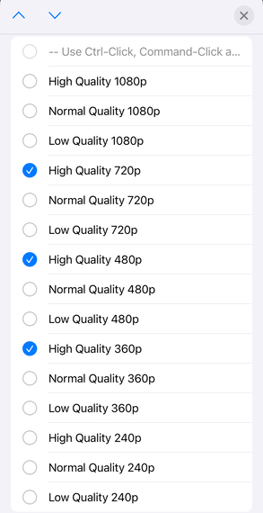
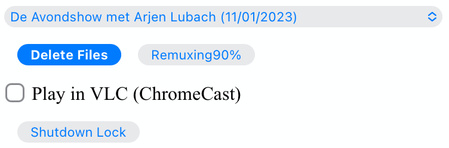

# Description

HTTP Live streaming and DASH support for
[MythTV](https://www.mythtv.org).

Why:

- Although support for HTTP Live Streaming (`HLS`) was added to
  [MythTV](https://www.mythtv.org) in v0.25 it is not yet fully
  functional and usable.
- [MythWeb](https://www.mythtv.org/wiki/MythWeb) is no longer actively
  developed and is based on Flash technology from the days of yore.
- HTML5 support for
  [WebFrontend](https://www.mythtv.org/wiki/WebFrontend) is work in
  progress.
- The new [Web Application](https://www.mythtv.org/wiki/Web_Application)
  (available since MythTV v34) interface does not provide streaming
  support.
- An earlier attempt to provide streaming support was made in the github
  project [MythTV stream mpeg
  DASH](https://github.com/thecount2a/mythtv-stream-mpeg-dash).
- All these implementations lack support for `HLS`, Adaptive Bitrate
  Streaming (`ABR`), live recording, live broadcast, subtitles,
  etcetera.

What:

- Support for HTTP based streaming (serving) of HDHomeRun, MythTV and
  MythVideo content.
- Support for device independent viewing: web browser—mobile, desktop,
  tablet, etc.
- Support for less reliable networks via video and audio renditions
  (e.g. cell phone browser).
- Support for live tv, live recording, video and recorded content.
- Support for offline viewing.
- Support for at most one (text based) embedded subtitle stream or
  external subtitle file.
- Support for multiple audio languages (and audio renditions).
- Support for MythTV cutlist (commercial cut) created using
  Mythfrontend.
- Support for VLC as an external player, which also enables Chromecast
  streaming capabilities.

How:

- MPEG-DASH and HLS with fragmented MP4 (fMP4) makes both compatible,
  therefore only the manifest file (playlist) is different.
- Video is codified in H.264 format and audio in AAC.
- Encode MythTV recordings and MythVideo content with `FFmpeg` providing
  playlist types `live`, `event` and `VOD`.
- Transcode to `MP4` for offline playback on mobile devices.
- HW accelerated support for VAAPI (other hw acceleration options are
  untested).
- Simple browser UI.
- Transcode videos to user defined (UI select dropdown list) renditions
  for adaptive playback.
- A Live TV UI allows for channel selection from a dropdown list.
- Optionally configure your preferred languages in the `php` files.
- Optionally a ramdisk can be used for in memory handling of playlist
  type `live`.
- Optionally shutdown lock can be used to prevent MythWelcome from
  shutting down.

# Installation

The installation below is based on Fedora and Apache as web server.
Adapting the code to your distribution / web server is left as an
exercise to the user.

Note: do not run the code as is in an untrusted environment and do not
open your web server to the internet. In either case additional security
measures should be taken. Use at your own risk.

## Dependency

- MythTV
  - Basically any version can be used. However, only version v0.34 and
    later, when building from source, can offer the complete experience
    via the new [Web
    Application](https://www.mythtv.org/wiki/Web_Application) UI.
- FFmpeg (for encoding)[^1]
  - FFmpeg version 5.1.3 or later
- GNU screen
  - This is to allow monitoring of encoding and to support background
    processes launched by the web-facing PHP script.
  - version 4.9.0 or later
- Shaka player
  - This is used as the built-in Javascript-based browser player.
  - version 4.3.6 or later
- Mediainfo
  - Used to loopup technical information about media files.
  - version 23.09 or later
- HDHomeRun
  - Firmware Version 20230713 or later

## Install dependencies

You can install MythTV using dnf as shown below. However, for the
complete experience, building from
[source](https://www.mythtv.org/wiki/Build_from_Source) is required.

``` shell
sudo dnf install ffmpeg screen mediainfo inotify-tools hdhomerun-devel sed mediainfo libva-utils intel-mediasdk mesa-va-drivers
```

## Create apache user

Create a web content owner[^2]:

``` shell
sudo useradd -d /var/www/ -g apache -M -N -s /sbin/nologin apache
sudo chown -R apache:apache /var/www/html
sudo chmod -R 755 /var/www/html
```

## Configure sudo

The backend code produces `bash` scripts. The commands within these
scripts should be executed as a web content owner user, e.g.
`apache`[^3], using `sudo`.

``` shell
cat /etc/sudoers.d/apache
apache ALL=(ALL) NOPASSWD: /usr/bin/hdhomerun_config, /usr/bin/ffmpeg, /usr/bin/realpath, /usr/bin/sed, /usr/bin/tail, /usr/bin/chmod, /usr/bin/mediainfo, /usr/bin/screen, /usr/bin/echo, /usr/bin/mkdir, /usr/bin/bash, /usr/bin/awk
```

Fill the content of a web content owner, e.g. `apache`,file as shown
above.

``` shell
sudo visudo -f /etc/sudoers.d/apache
```

## Install Shaka-player

``` shell
git clone https://github.com/shaka-project/shaka-player.git
cd shaka-player
python build/all.py
sudo mkdir -p /var/www/html/dist
sudo chown apache:apache /var/www/html/dist
sudo -uapache rsync -avh dist/ /var/www/html/dist/
```

## Install mythtv-stream-hls-dash

``` shell
git clone https://github.com/alders/mythtv-stream-hls-dash.git
sudo mkdir -p /var/www/html/mythtv-stream-hls-dash
sudo chown apache:apache /var/www/html/mythtv-stream-hls-dash
sudo -uapache rsync -avnh --exclude='.git/' mythtv-stream-hls-dash/*.php /var/www/html/mythtv-stream-hls-dash/
```

## Patch MythWeb

Optional step, modify 2 lines of
[MythWeb](https://www.mythtv.org/wiki/MythWeb)[^4] code to change ASX
Stream button on the "Recorded Programs" page to `Stream HLS DASH`
button.

<details>
<summary>
Click to configure MythWeb.
</summary>

``` shell
diff --git a/modules/tv/tmpl/default/recorded.php b/modules/tv/tmpl/default/recorded.php
index 8502305b..7bf3db0b 100644
--- a/modules/tv/tmpl/default/recorded.php
+++ b/modules/tv/tmpl/default/recorded.php
@@ -158,8 +158,8 @@ EOM;
             echo ' -noimg">';
 ?>
         <a class="x-download"
-            href="<?php echo video_url($show, true) ?>" title="<?php echo t('ASX Stream'); ?>"
-            >/img/play_sm.png" alt="<?php echo t('ASX Stream'); ?>"></a>
+            target="_blank" href="/mythtv-stream-hls-dash/index.php?filename=<?php echo $show->chanid."_".gmdate('YmdHis', $show->recstartts) ?>" title="<?php echo 'Stream HLS DASH'; ?>"
+            >/img/play_sm.png" alt="<?php echo 'Stream HLS DASH'; ?>"></a>
         <a class="x-download"
             href="<?php echo $show->url ?>" title="<?php echo t('Direct Download'); ?>"
             >/img/video_sm.png" alt="<?php echo t('Direct Download'); ?>"></a>
```

</details>

## Patch Web Application

Optionally change a few lines in the [Web
Application](https://www.mythtv.org/wiki/Web_Application)[^5] code to
allow recording and / or video and / or live tv selection from your
browser. Replace `yourserver` in the patches below with your combined
web server / `mythbackend` address.

<details>
<summary>
Click to adapt the recording selection of the Web Application for seamless playback on any device.
</summary>

``` shell
diff --git a/mythtv/html/backend/src/app/dashboard/recordings/recordings.component.html b/mythtv/html/backend/src/app/dashboard/recordings/recordings.component.html
index 4618e41aa8..8bae11e03a 100644
--- a/mythtv/html/backend/src/app/dashboard/recordings/recordings.component.html
+++ b/mythtv/html/backend/src/app/dashboard/recordings/recordings.component.html
@@ -76,7 +76,8 @@
                     <td style="flex-basis: 12%" class="p-1 overflow-hidden">
                         <i class="pi pi-exclamation-triangle p-1" *ngIf="program.VideoPropNames.indexOf('DAMAGED') > -1"
                             pTooltip="{{ 'dashboard.recordings.damaged' | translate }}" tooltipPosition="top"></i>
-                        {{program.Title}}
+                       <a href="{{URLencode('http://yourserver/mythtv-stream-hls-dash/index.php?filename=' + program.Recording.FileName.split('.').slice(0, -1).join('.'))}}" target="_blank">{{program.Title}}</a></td>
+
                     </td>
                     <td style="flex-basis: 2%" class="p-1">
                         <i class="pi pi-eye" *ngIf="program.ProgramFlagNames.indexOf('WATCHED') > -1"
```

</details>

<details>
<summary>
Click to adapt the video selection of the  Web Application for playback on any device.
</summary>

``` shell
diff --git a/mythtv/html/backend/src/app/dashboard/videos/videos.component.html b/mythtv/html/backend/src/app/dashboard/videos/videos.component.html
index 2d75b5e0ab..42abea28ac 100644
--- a/mythtv/html/backend/src/app/dashboard/videos/videos.component.html
+++ b/mythtv/html/backend/src/app/dashboard/videos/videos.component.html
@@ -68,7 +68,7 @@
                                 (click)="onDirectory(video.Title)" label="{{video.Title}}"></button>
                         </div>
                         <ng-template #title>
-                            {{video.Title}}
+                            <a href="{{URLencode('http://yourserver/mythtv-stream-hls-dash/index.php?videoid=' + video.Id)}}" target="_blank">{{video.Title}}</a>
                         </ng-template>
                     </td>
                     <td style="flex-basis: 3%" class="p-1">
```

</details>

<details>
<summary>
Click to adapt the tv channel selection of the Web Application for playback on any device.
</summary>

``` shell
diff --git a/mythtv/html/backend/src/app/guide/components/channelicon/channelicon.component.html b/mythtv/html/backend/src/app/guide/components/channelicon/channelicon.component.html
index 44abe96fea..c17429ef6c 100644
--- a/mythtv/html/backend/src/app/guide/components/channelicon/channelicon.component.html
+++ b/mythtv/html/backend/src/app/guide/components/channelicon/channelicon.component.html
@@ -4,6 +4,6 @@
         <ng-template #nullIcon></ng-template>
     </div>
     <div class="channelText">
-        <span>{{ channel.ChanNum}} {{ channel.CallSign }}</span>
+        <span><a href="{{URLencode('http://yourserver/mythtv-stream-hls-dash/hdhomerunstream.php?quality[]=high480&hw=h264&channel=' + CallSignEncode(channel.CallSign) + '&do=Watch+TV')}}" target="_blank">{{channel.ChanNum}} {{ channel.CallSign }}</a></span>
     </div>
</div>
diff --git a/mythtv/html/backend/src/app/guide/components/channelicon/channelicon.component.ts b/mythtv/html/backend/src/app/guide/components/channelicon/channelicon.component.ts
index 97ae71efa8..f088012f94 100644
--- a/mythtv/html/backend/src/app/guide/components/channelicon/channelicon.component.ts
+++ b/mythtv/html/backend/src/app/guide/components/channelicon/channelicon.component.ts
@@ -16,4 +16,12 @@ export class ChannelIconComponent implements OnInit {
   ngOnInit(): void {
   }

+  URLencode(x: string): string {
+      let trimmed = x.replace(/\s+/g, '');
+      return encodeURI(trimmed);
+  }
+  CallSignEncode(x: string): string {
+    return x.replace(/\//g, '');
+  }
 }
```

</details>

<details>
<summary>
Click to adapt the Web Application adding video search to MythTV v34.
</summary>

``` shell
diff --git a/mythtv/html/backend/src/app/dashboard/videos/videos.component.html b/mythtv/html/backend/src/app/dashboard/videos/videos.component.html
index 2d75b5e0ab..5302e8724e 100644
--- a/mythtv/html/backend/src/app/dashboard/videos/videos.component.html
+++ b/mythtv/html/backend/src/app/dashboard/videos/videos.component.html
@@ -22,6 +22,7 @@
                                 styleClass="p-button-primary">
                             </p-button>
                         </div>
+                        <p-columnFilter type="text" field="Title" [matchModeOptions]="matchModeOptions"></p-columnFilter>
                         &nbsp;&nbsp;&nbsp;
                         <p-checkbox inputId="showAllVideos" [(ngModel)]="showAllVideos" name="showAllVideos"
diff --git a/mythtv/html/backend/src/app/dashboard/videos/videos.component.ts b/mythtv/html/backend/src/app/dashboard/videos/videos.component.ts
index e46aa6c0aa..9c9a2a9aaa 100644
--- a/mythtv/html/backend/src/app/dashboard/videos/videos.component.ts
+++ b/mythtv/html/backend/src/app/dashboard/videos/videos.component.ts
@@ -5,6 +5,7 @@ import { LazyLoadEvent, MenuItem, MessageService } from 'primeng/api';
 import { Menu } from 'primeng/menu';
 import { Table } from 'primeng/table';
 import { PartialObserver } from 'rxjs';
+import { SelectItem, FilterService, FilterMatchMode } from 'primeng/api';
 import { GetVideoListRequest, UpdateVideoMetadataRequest, VideoMetadataInfo } from 'src/app/services/interfaces/video.interface';
 import { UtilityService } from 'src/app/services/utility.service';
 import { VideoService } from 'src/app/services/video.service';
@@ -22,6 +23,7 @@ export class VideosComponent implements OnInit {
   @ViewChild("table") table!: Table;

   videos: VideoMetadataInfo[] = [];
+  searchVideos: VideoMetadataInfo[] = [];
   refreshing = false;
   successCount = 0;
   errorCount = 0;
@@ -33,6 +35,20 @@ export class VideosComponent implements OnInit {
   showAllVideos = false;
   lazyLoadEvent!: LazyLoadEvent;

+  matchModeOptions = [{
+      value: FilterMatchMode.STARTS_WITH,
+      label: 'Starts With',
+  },
+  {
+      value: FilterMatchMode.CONTAINS,
+      label: 'Contains',
+  },
+  {
+      value: FilterMatchMode.EQUALS,
+      label: 'Equals',
+  }
+  ];
+
   mnu_markwatched: MenuItem = { label: 'dashboard.recordings.mnu_markwatched', command: (event) => this.markwatched(event, true) };
   mnu_markunwatched: MenuItem = { label: 'dashboard.recordings.mnu_markunwatched', command: (event) => this.markwatched(event, false) };
   mnu_updatemeta: MenuItem = { label: 'dashboard.recordings.mnu_updatemeta', command: (event) => this.updatemeta(event) };
@@ -73,7 +89,7 @@ export class VideosComponent implements OnInit {
     let request: GetVideoListRequest = {
       Sort: "title",
       Folder: this.directory.join('/'),
-      CollapseSubDirs: !this.showAllVideos,
+      CollapseSubDirs: this.showAllVideos,
       StartIndex: 0,
       Count: 1
     };
@@ -91,17 +107,60 @@ export class VideosComponent implements OnInit {
       request.Count = event.rows;
     }

-    this.videoService.GetVideoList(request).subscribe(data => {
-      let newList = data.VideoMetadataInfoList;
-      this.videos.length = data.VideoMetadataInfoList.TotalAvailable;
-      // populate page of virtual programs
-      this.videos.splice(newList.StartIndex, newList.Count,
-        ...newList.VideoMetadataInfos);
-      // notify of change
-      this.videos = [...this.videos]
-      this.refreshing = false;
-    });
+    let regex: RegExp;
+    let regexDefined: boolean = false;
+    if (event.filters) {
+      if (event.filters.Title.value) {
+        switch (event.filters.Title.matchMode) {
+          case FilterMatchMode.STARTS_WITH:
+            regex = new RegExp('^' + event.filters.Title.value, "i");
+            regexDefined = true;
+            break;
+          case FilterMatchMode.CONTAINS:
+            regex = new RegExp(event.filters.Title.value, "i");
+            regexDefined = true;
+            break;
+          case FilterMatchMode.EQUALS:
+            regex = new RegExp('^' + event.filters.Title.value + '$', "i");
+            regexDefined = true;
+            break;
+        }
+      }
+    }

+    if (regexDefined) {
+      // This is not lazy...
+      let requestAll: GetVideoListRequest = {
+        Sort: "title",
+        Folder: this.directory.join('/'),
+        CollapseSubDirs: this.showAllVideos,
+        StartIndex: 0,
+      };
+
+      this.videoService.GetVideoList(requestAll).subscribe(data => {
+        let newList = data.VideoMetadataInfoList;
+        this.searchVideos.length = data.VideoMetadataInfoList.TotalAvailable;
+        this.searchVideos.splice(newList.StartIndex, newList.Count,
+            ...newList.VideoMetadataInfos);
+        this.searchVideos = this.searchVideos.filter((value) => regex.test(value.Title));
+        if (this.searchVideos.length > 0) {
+          // notify of change
+          this.videos = [...this.searchVideos];
+          this.refreshing = false;
+        }
+      });
+    } else {
+      this.videoService.GetVideoList(request).subscribe(data => {
+        let newList = data.VideoMetadataInfoList;
+        this.videos.length = data.VideoMetadataInfoList.TotalAvailable;
+        // populate page of virtual programs
+        this.videos.splice(newList.StartIndex, newList.Count,
+           ...newList.VideoMetadataInfos);
+        // notify of change
+        this.videos = [...this.videos]
+        this.refreshing = false;
+      });
+    }
   }
```

</details>

For MythTV v35 a pull request can be found
[here](https://github.com/MythTV/mythtv/pull/1078/files). Part of this
code has been merged into master offering video category selection as
well.

To apply these optional [Web
Application](https://www.mythtv.org/wiki/Web_Application) changes run
the npm build script and install the web application.

<details>
<summary>
Click to run the npm build script.
</summary>

``` shell
cd mythtv/mythtv/html/backend/
npm run-script build
cd ..
sudo make install
```

</details>

## In memory processing

Optional step, add these (or similar) lines depending on your
installation to `/etc/fstab` to create a ramdisk for playlist `live` and
`channel`.

<details>
<summary>
Click to configure a ramdisk
</summary>

``` shell
tmpfs                                           /var/www/html/live tmpfs nodev,nosuid,noexec,nodiratime,size=200M 0  0
tmpfs                                           /var/www/html/channel tmpfs nodev,nosuid,nodiratime,size=200M 0  0
```

</details>

## Additional configuration

Required configuration (check the `php` files):

- \$webroot – This is the root of your web server.
- \$webuser – This is the web content run user.
- \$xml – Make sure your MythTV
  [Config.xml](https://www.mythtv.org/wiki/Config.xml) is readable by
  `$webuser`.

Optional configuration (check the `php` files):

- \$hlsdir – This is the directory where the meta data of all encoded
  videos are stored. Moreover playlist `event` videos are stored here.
- \$livedir – This is the directory where playlist `live` videos are
  stored.
- \$voddir – This is the directory where playlist `vod` videos are
  stored.
- \$ffmpeg – This variable points to the `FFmpeg` executable. Note, one
  may point this variable to `mythffmpeg`. However subtitles handling
  would not be supported.
- \$hwaccels – This array specifies the hw acceleration options for
  `FFmpeg`. Note: only `h264` and `nohwaccel` has been tested.
- \$settings – This array specifies the ladder the user may choose for
  his renditions.
- \$sublangpref – This array contains your preferred languages in order.
  If available, the first match from top to bottom will be used as
  subtitle.

## Allow JavaScript

Allow JavaScript in your browser.

# HTTP streaming

## Example

### User interface

Figure 1 illustrates the user interface of `mythtv-stream-hls-dash`
after selecting a recording in
[MythWeb](https://www.mythtv.org/wiki/MythWeb) or the new [Web
Application](https://www.mythtv.org/wiki/Web_Application)[^6].

In case you do not want to patch
[MythWeb](https://www.mythtv.org/wiki/MythWeb) and the new [Web
Application](https://www.mythtv.org/wiki/Web_Application) find the
filename in your recording directory, remove the extension from the
filename and browse to
<http://yourserver/mythtv-stream-hls-dash/index.php?filename=NNNN_NNNNNNNNNNNNNN>.
For video extract the videoid from the download link in [Web
Application](https://www.mythtv.org/wiki/Web_Application) and browse to
<http://yourserver/mythtv-stream-hls-dash/video.php?videoid=NNNN>.

**Figure 1:** *User interface.*


The user interface provides the following options, listed from top to
bottom:

- **Select an available recording**: Choose a recording from the list
  box [^7].
- **Select ABR renditions**: Select the desired Adaptive Bitrate
  Streaming (ABR) renditions from the dropdown list box, see Figure 2.
- **Select HW acceleration**: Choose the hardware acceleration option
  from the list box [^8].
- **Use Cutlist**: Decide whether to use the cutlist using the list box
  [^9].
- **Create Subtitles**: Select whether to create subtitles using the
  checkbox [^10].
- **Playlist Type**: Choose the playlist type [^11]:
  - **Live**: Select using the checkbox.
  - **Event**: Select using the checkbox.
- **VOD Playlist**: Select whether to use a Video-on-Demand (VOD)
  playlist using the checkbox .
- **Create MP4 File**: Choose whether to create an MP4 file using the
  checkbox.
- **Encode Video**: Press the Encode Video button to start encoding when
  you are satisfied with your selections.

### Example and Variations

The selections shown in Figure 1 are used as a running example below.
Note that the user interface for selecting a video instead of a
recording from [Web
Application](https://www.mythtv.org/wiki/Web_Application) has a similar
look and feel, but with some differences in functionality. For example:

- Commercial cut is only available for recordings, not for videos.

### Adaptive Bitrate Streaming

Figure 2 illustrates the user interface on a phone, which allows you to
select renditions for Adaptive Bitrate Streaming (ABR). To choose
multiple renditions, use the following keyboard shortcuts:

1.  Windows: Ctrl-Click
2.  Apple: Command-Click

**Figure 2:** *Adaptive Bitrate UI.*



### Remuxing

This remux step is performed when the [commercials are manually
cut](https://www.mythtv.org/wiki/Editing_Recordings) in `mythfrontend`,
and the use of the `Cutlist` was selected in the UI. Remuxing may also
be required when otherwise the input video format cannot be processed
(e.g. `avi`). In the latter case remuxing is done automatically.

Figure 3 illustrates the user interface that appears while remuxing.
Because `Cut Commercials` was selected in Figure 1, in the first
processing step the video is remuxed to an `MP4` container.

**Figure 3:** *Remuxing UI.*



### Control Buttons

Below the available recording list box, three buttons are provided for
convenient control:

- **Delete Files**: This button allows you to delete files, making it
  easy to manage your recordings [^12].
- **Status Button**: This button displays a dynamic message that updates
  in real-time. For example, Figure 3 shows the Remuxing percentage,
  giving you insight into the processing progress.
- **Shutdown Lock**: This button enables you to prevent
  [MythWelcome](https://www.mythtv.org/wiki/index.php/Mythwelcome) from
  shutting down by setting a value greater than zero. When combined with
  Wake-On-Lan (WOL) configured on your MythTV backend machine, you can
  maintain full control over the app from your browser.

### Radio Button

A radio button is also provided, allowing for playback in VLC once the
video stream becomes available. More on this below.

### Generating m3u8

Figure 4 illustrates the user interface that appears while the video is
being encoded. This interface provides a visual representation of the
encoding progress, allowing you to track the status of your video
processing task.

**Figure 4:** *Generating m3u8.*


The progress of the encoding is displayed on the status button as a
percentage, along with the time of the video available.

On the right hand side of the `Shutdown Lock` button, additional buttons
dynamically appear when files become available on disk. These buttons
may include `HLS,` `HLS VOD`, and `DASH VOD`. The video should load
automatically within 15 seconds [^13]. If playback doesn't start, you
can select one of these buttons to initiate playback. As a last resort,
reloading the web page may also resolve the issue.

### Status button

Figure 5 illustrates the processing status update that appears when the
status button is selected. A popup message box will be triggered,
providing a detailed view of the steps involved and their current
status.

In this example three processing steps were required:

1.  Remux to `mp4` container for commercial cut.
2.  Encoding to the various playlists.
3.  Subtitle merge into the `mp4` file.

**Figure 5:** *Status UI.*


### User interface after encoding

Figure 6 illustrates the interface after the encoding process is
complete.

**Figure 6:** *User interface after encoding.*


As illustrated in Figure 6, two additional buttons have been introduced,
providing users with new functionality: `Cleanup Event` [^14] and
`MP4 or
Download`.

### Removing HLS Playlist Files to Save Disk Space

If you have both `HLS` and `HLS VOD` playlists, you may want to consider
removing the `HLS` playlist files to save disk space. The
`Cleanup Event` button allows you to easily remove these files.

### How to Remove HLS Playlist Files

1.  Click on the `Cleanup Event` button.
2.  The `HLS` playlist files will be removed, freeing up disk space.

### What to Expect After Encoding

After encoding is complete, you will see an updated interface that
includes the `MP4 or Download` button. This button is only visible after
the encoding process has finished and subtitles have been added to the
video.

### Playback on Older Devices

If you have older devices that don't support the Shaka video player, you
can still play media using the buttons provided. These buttons link to
the various manifest files, allowing you to play the media on devices
that don't support the Shaka player.

### Chromecast Support

Figure 7 shows the same interface now with the radio button checked.

**Figure 7:** *User interface after encoding.*


Chromecast integration is supported by the [Shaka-player
UI](https://deepwiki.com/shaka-projects/shaka-player/8.1-chromecast-integration)
out of the box, but there are some requirements to consider.
Alternatively, you can use [VLC](HTTPS://www.videolan.org/vlc/), which
also supports Chromecast, especially with HTTP streams.

When the radio button is checked as shown in Figure 7, it modifies the
button links to play directly in `VLC`, making it easy to play the media
in your preferred app. This may also enable Chromecast playback.

## Generated script

After pressing the `Encode Video` in Figure 1 a `bash` shell script is
generated. For illustration purposes the code for the running example is
shown in separate code blocks below.

### Remuxing

When the user selects `Cut Commercials` in Figure 1 the video needs to
be remuxed to an `MP4` container. This process is illustrated in the
user interface of Figure 3.

The code block below provides a detailed example how this is done.

Using an `MP4` container allows FFmpeg to utilize the `concat demuxer`
later in the script[^15]. This demuxer enables FFmpeg to concatenate
multiple video segments, which is essential for cutting commercials.

<details>
<summary>
Click to reveal the script code.
</summary>

``` shell
cd /var/www/html/hls/10100_20231101212100
/usr/bin/sudo /usr/bin/screen -S 10100_20231101212100_remux -dm /usr/bin/sudo -uapache /usr/bin/bash -c '/usr/bin/echo `date`: remux start > /var/www/html/hls/10100_20231101212100/status.txt;
/usr/bin/sudo -uapache /usr/bin/ffmpeg \
  -y \
  -hwaccel vaapi -vaapi_device /dev/dri/renderD128 \
  -txt_format text -txt_page 888 \
  -fix_sub_duration \
  -i "/mnt/mythtv2/store//10100_20231101212100.ts" \
  -c copy \
  -c:s mov_text \
/var/www/html/hls/10100_20231101212100/video.mp4 && \
/usr/bin/echo `date`: remux finish success >> /var/www/html/hls/10100_20231101212100/status.txt || \
/usr/bin/echo `date`: remux finish failed >> /var/www/html/hls/10100_20231101212100/status.txt'
while [ ! "`/usr/bin/cat /var/www/html/hls/10100_20231101212100/status.txt | /usr/bin/grep 'remux finish success'`" ] ; \
do \
    sleep 1; \
done
```

</details>

### Adapt playlist `master_event.m3u8` file

Once FFmpeg creates the file, the `master_event.m3u8` playlist is
adapted to ensure seamless playback. This adaptation process configures
the handling of audio and subtitles (if present) according to the
specified settings.

<details>
<summary>
Click to reveal the script code.
</summary>

``` shell
((while [ ! -f "/var/www/html/hls/10100_20231101212100/master_event.m3u8" ] ;
 do
    /usr/bin/inotifywait -e close_write --include "master_event.m3u8"  /var/www/html/hls/10100_20231101212100;
 done;
   for i in {1..2}; do
    /usr/bin/sudo -uapache /usr/bin/sed -i -E 's/(#EXT-X-VERSION:7)/\1\n#EXT-X-MEDIA:TYPE=SUBTITLES,GROUP-ID="subtitles",NAME="Dutch",DEFAULT=YES,FORCED=NO,AUTOSELECT=YES,URI="sub_0_vtt.m3u8",LANGUAGE="dut"/' /var/www/html/hls/10100_20231101212100/master_event.m3u8;
    /usr/bin/sudo -uapache /usr/bin/sed -i -E 's/(#EXT-X-STREAM.*)/\1,SUBTITLES="subtitles"/'  /var/www/html/hls/10100_20231101212100/master_event.m3u8; \
    /usr/bin/sudo -uapache /usr/bin/sed -i -E '4s/$/,ROLE="0",LANGUAGE="dut-192k_0"/' /var/www/html/hls/10100_20231101212100/master_event.m3u8; \
    /usr/bin/sudo -uapache /usr/bin/sed -i -E '4s/NAME=[^,]*/NAME="Dutch 0 \(192k\)"/' /var/www/html/hls/10100_20231101212100/master_event.m3u8; \
    /usr/bin/sudo -uapache /usr/bin/sed -i -E '4s/LANGUAGE=[^,]*,//' /var/www/html/hls/10100_20231101212100/master_event.m3u8; \
    /usr/bin/sudo -uapache /usr/bin/sed -i -E '5s/$/,ROLE="1",LANGUAGE="dut-128k_1"/' /var/www/html/hls/10100_20231101212100/master_event.m3u8; \
    /usr/bin/sudo -uapache /usr/bin/sed -i -E '5s/NAME=[^,]*/NAME="Dutch 1 \(128k\)"/' /var/www/html/hls/10100_20231101212100/master_event.m3u8; \
    /usr/bin/sudo -uapache /usr/bin/sed -i -E '5s/LANGUAGE=[^,]*,//' /var/www/html/hls/10100_20231101212100/master_event.m3u8;
    /usr/bin/inotifywait -e modify --include "master_event.m3u8"  /var/www/html/hls/10100_20231101212100;
 done) &
```

</details>

### Adapt playlist `master_vod.m3u8` file

As soon as the file is created by FFmpeg, the playlist `master_vod.m3u8`
file is adapted to ensure seamless playback. This adaptation allows the
player to start playing at the beginning of the video and if present
defines according to the setting the handling of the subtitle.

<details>
<summary>
Click to reveal the script code.
</summary>

``` shell
((while [ ! -f "/var/www/html/vod/10100_20231101212100/master_vod.m3u8" ] ;
 do
    /usr/bin/inotifywait -e close_write --include "master_vod.m3u8" /var/www/html/vod/10100_20231101212100;
 done;
   for i in {1..2}; do
    /usr/bin/sudo -uapache /usr/bin/sed -i -E 's/(#EXT-X-VERSION:7)/\1\n#EXT-X-MEDIA:TYPE=SUBTITLES,GROUP-ID="subtitles",NAME="Dutch",DEFAULT=YES,FORCED=NO,AUTOSELECT=YES,URI="sub_0_vtt.m3u8",LANGUAGE="dut"/' /var/www/html/vod/10100_20231101212100/master_vod.m3u8;
    /usr/bin/sudo -uapache /usr/bin/sed -i -E 's/(#EXT-X-STREAM.*)/\1,SUBTITLES="subtitles"/' /var/www/html/vod/10100_20231101212100/master_vod.m3u8; \
    /usr/bin/sudo -uapache /usr/bin/sed -i -E '4s/$/,ROLE="0",LANGUAGE="dut-192k_0"/' /var/www/html/vod/10100_20231101212100/master_vod.m3u8; \
    /usr/bin/sudo -uapache /usr/bin/sed -i -E '4s/NAME=[^,]*/NAME="Dutch 0 \(192k\)"/' /var/www/html/vod/10100_20231101212100/master_vod.m3u8; \
    /usr/bin/sudo -uapache /usr/bin/sed -i -E '4s/LANGUAGE=[^,]*,//' /var/www/html/vod/10100_20231101212100/master_vod.m3u8; \
    /usr/bin/sudo -uapache /usr/bin/sed -i -E '5s/$/,ROLE="1",LANGUAGE="dut-128k_1"/' /var/www/html/vod/10100_20231101212100/master_vod.m3u8; \
    /usr/bin/sudo -uapache /usr/bin/sed -i -E '5s/NAME=[^,]*/NAME="Dutch 1 \(128k\)"/' /var/www/html/vod/10100_20231101212100/master_vod.m3u8; \
    /usr/bin/sudo -uapache /usr/bin/sed -i -E '5s/LANGUAGE=[^,]*,//' /var/www/html/vod/10100_20231101212100/master_vod.m3u8;
    /usr/bin/inotifywait -e modify --include "master_vod.m3u8"  /var/www/html/vod/10100_20231101212100;
 done) &
```

</details>

### FFmpeg encoding

The majority of the encoding process is accomplished in a single FFmpeg
command, leveraging the power of `filter_complex` and `tee` to maximize
efficiency.

The code block below initiates the encoding process and waits for its
completion:

<details>
<summary>
Click to reveal the script code.
</summary>

``` shell
//usr/bin/sudo -uapache /usr/bin/bash -c '/usr/bin/echo `date`: encode start >> /var/www/html/hls/10100_20231101212100/status.txt';
/usr/bin/sudo -uapache /usr/bin/mkdir -p /var/www/html/vod/10100_20231101212100;

/usr/bin/sudo -uapache /usr/bin/mkdir -p /var/www/html/hls/10100_20231101212100;
cd /var/www/html/hls/;
/usr/bin/sudo -uapache /usr/bin/ffmpeg \
    -fix_sub_duration \
    -txt_format text -txt_page 888 \
    -hwaccel vaapi -vaapi_device /dev/dri/renderD128 \
     \
    -f concat -async 1 -safe 0 -i /var/www/html/hls/10100_20231101212100/cutlist.txt \
    -progress 10100_20231101212100/progress-log.txt \
    -live_start_index 0 \
    -tune film \
    -metadata title="De Avondshow met Arjen Lubach" \
    -force_key_frames "expr:gte(t,n_forced*2)" \
    -filter_complex "[0:v]split=3[v1][v2][v3];[v1]format=nv12|vaapi,hwupload,scale_vaapi=w=1920:h=1080[v1out];[v2]format=nv12|vaapi,hwupload,scale_vaapi=w=1280:h=720[v2out];[v3]format=nv12|vaapi,hwupload,scale_vaapi=w=854:h=480[v3out]" \
    -map [v1out] -c:v:0 \
        h264_vaapi \
        -b:v:0 5300k \
        -maxrate:v:0 5300k \
        -bufsize:v:0 1.5*5300k \
        -crf 23 \
        -preset veryfast \
        -g 48 \
        -keyint_min 48 \
        -sc_threshold 0 \
        -flags +global_header \
    -map [v2out] -c:v:1 \
        h264_vaapi \
        -b:v:1 3200k \
        -maxrate:v:1 3200k \
        -bufsize:v:1 1.5*3200k \
        -crf 23 \
        -preset veryfast \
        -g 48 \
        -keyint_min 48 \
        -sc_threshold 0 \
        -flags +global_header \
    -map [v3out] -c:v:2 \
        h264_vaapi \
        -b:v:2 1600k \
        -maxrate:v:2 1600k \
        -bufsize:v:2 1.5*1600k \
        -crf 23 \
        -preset veryfast \
        -g 48 \
        -keyint_min 48 \
        -sc_threshold 0 \
        -flags +global_header \
 \
    -map a:0 -c:a:0 aac -b:a:0 192k \
              -metadata:s:a:0 language=dut -metadata:s:a:0 name=Dutch \
    -map a:0 -c:a:1 aac -b:a:1 128k \
              -metadata:s:a:1 language=dut -metadata:s:a:1 name=Dutch \
    -ac 2  \
 \
    -map 0:s:0 -c:s webvtt -metadata:s:s:0 language=dut \
    -f tee \
        "[select=\'a:0,a:1,v:0,v:1,v:2\': \
          f=dash: \
          seg_duration=2: \
          hls_playlist=true: \
          single_file=true: \
          adaptation_sets=\'id=0,streams=a id=1,streams=v\' : \
          media_seg_name=\'stream_vod_$RepresentationID$-$Number%05d$.$ext$\': \
          hls_master_name=master_vod.m3u8]../vod/10100_20231101212100/manifest_vod.mpd| \
         [select=\'v:0,s:0\': \
          strftime=1: \
          hls_flags=+independent_segments+iframes_only: \
          hls_time=2: \
          hls_playlist_type=event: \
          hls_segment_type=fmp4: \
          var_stream_map=\'v:0,s:0,sgroup:subtitle\': \
          hls_segment_filename=\'/dev/null\']../vod/10100_20231101212100/sub_%v.m3u8| \
          [select=\'a:0,a:1,v:0,v:1,v:2\': \
          f=mp4: \
          movflags=+faststart]10100_20231101212100/10100_20231101212100 - De Avondshow met Arjen Lubach.mp4| \
          [select=\'s:0\']10100_20231101212100/subtitles.vtt| \
          /dev/null| \
          [select=\'a:0,a:1,v:0,v:1,v:2\': \
          f=hls: \
          hls_time=2: \
          hls_playlist_type=event: \
          hls_flags=+independent_segments+iframes_only: \
          hls_segment_type=fmp4: \
          var_stream_map=\'a:0,agroup:aac,language:dut-0,name:Dutch-aac-0-192k,default:yes a:1,agroup:aac,language:dut-1,name:Dutch-aac-1-128k,default:no v:0,agroup:aac,name:1080p_5300 v:1,agroup:aac,name:720p_3200 v:2,agroup:aac,name:480p_1600\': \
          master_pl_name=master_event.m3u8: \
          hls_segment_filename=10100_20231101212100/stream_event_%v_data%02d.m4s]10100_20231101212100/stream_event_%v.m3u8| \
         [select=\'v:0,s:0\': \
          strftime=1: \
          f=hls: \
          hls_flags=+independent_segments+program_date_time: \
          hls_time=2: \
          hls_playlist_type=event: \
          hls_segment_type=fmp4: \
          var_stream_map=\'v:0,s:0,sgroup:subtitle\': \
          hls_segment_filename=\'/dev/null\']10100_20231101212100/sub_%v.m3u8" \
2>>/tmp/ffmpeg-hls-10100_20231101212100.log && \
/usr/bin/sudo -uapache /usr/bin/bash -c '/usr/bin/echo `date`: encode finish success >> /var/www/html/hls/10100_20231101212100/status.txt' || \
/usr/bin/sudo -uapache /usr/bin/bash -c '/usr/bin/echo `date`: encode finish failed >> /var/www/html/hls/10100_20231101212100/status.txt'
while [ ! "`/usr/bin/cat /var/www/html/hls/10100_20231101212100/status.txt | /usr/bin/grep 'encode finish success'`" ] ;
do
    sleep 1;
done
```

</details>

### Add subtitles to MP4

In a post-processing step subtitles are added to the `MP4`.

<details>
<summary>
Click to reveal the script code.
</summary>

``` shell
cd /var/www/html/hls/10100_20231101212100;
/usr/bin/sudo -uapache /usr/bin/bash -c '/usr/bin/echo `date`: subtitle_merge start >> /var/www/html/hls/10100_20231101212100/status.txt';
cd /var/www/html/hls/10100_20231101212100;
/usr/bin/sudo -uapache /usr/bin/ffmpeg \
    -i "10100_20231101212100 - De Avondshow met Arjen Lubach.mp4" \
    -i subtitles.vtt \
    -c:v copy \
    -c:a copy \
    -map 0 \
    -c:s mov_text -metadata:s:s:0 language=dut -disposition:s:0 default \
    -map 1 \
    "10100_20231101212100 - De Avondshow met Arjen Lubach.tmp.mp4" \
2>>/tmp/ffmpeg-subtitle-merge-hls-10100_20231101212100.log && \
/usr/bin/sudo -uapache /usr/bin/bash -c '/usr/bin/echo `date`: subtitle_merge success >> /var/www/html/hls/10100_20231101212100/status.txt' || \
/usr/bin/sudo -uapache /usr/bin/bash -c '/usr/bin/echo `date`: subtitle_merge failed >> /var/www/html/hls/10100_20231101212100/status.txt';
/usr/bin/sudo /usr/bin/mv -f "10100_20231101212100 - De Avondshow met Arjen Lubach.tmp.mp4" "10100_20231101212100 - De Avondshow met Arjen Lubach.mp4"
while [ ! "`/usr/bin/cat /var/www/html/hls/10100_20231101212100/status.txt | /usr/bin/grep 'encode finish success'`" ] ;
do
    sleep 1;
done
/usr/bin/sudo /usr/bin/rm /var/www/html/hls/10100_20231101212100/video.mp4
sleep 3 && /usr/bin/sudo /usr/bin/screen -ls 10100_20231101212100_encode  | /usr/bin/grep -E '\s+[0-9]+.' | /usr/bin/awk '{print $1}' - | while read s; do /usr/bin/sudo /usr/bin/screen -XS $s quit; done
```

</details>

### Complete script

For completeness the whole script.

<details>
<summary>
Click to reveal the script code.
</summary>

``` shell
cd /var/www/html/hls/10100_20231101212100
/usr/bin/sudo /usr/bin/screen -S 10100_20231101212100_remux -dm /usr/bin/sudo -uapache /usr/bin/bash -c '/usr/bin/echo `date`: remux start > /var/www/html/hls/10100_20231101212100/status.txt;
/usr/bin/sudo -uapache /usr/bin/ffmpeg \
  -y \
  -hwaccel vaapi -vaapi_device /dev/dri/renderD128 \
  -txt_format text -txt_page 888 \
  -fix_sub_duration \
  -i "/mnt/mythtv2/store//10100_20231101212100.ts" \
  -c copy \
  -c:s mov_text \
/var/www/html/hls/10100_20231101212100/video.mp4 && \
/usr/bin/echo `date`: remux finish success >> /var/www/html/hls/10100_20231101212100/status.txt || \
/usr/bin/echo `date`: remux finish failed >> /var/www/html/hls/10100_20231101212100/status.txt'
while [ ! "`/usr/bin/cat /var/www/html/hls/10100_20231101212100/status.txt | /usr/bin/grep 'remux finish success'`" ] ; \
do \
    sleep 1; \
done
(while [ ! -f "/var/www/html/hls/10100_20231101212100/master_event.m3u8" ] ;
 do
    /usr/bin/inotifywait -e close_write --include "master_event.m3u8"  /var/www/html/hls/10100_20231101212100;
 done;
   for i in {1..2}; do
    /usr/bin/sudo -uapache /usr/bin/sed -i -E 's/(#EXT-X-VERSION:7)/\1\n#EXT-X-MEDIA:TYPE=SUBTITLES,GROUP-ID="subtitles",NAME="Dutch",DEFAULT=YES,FORCED=NO,AUTOSELECT=YES,URI="sub_0_vtt.m3u8",LANGUAGE="dut"/' /var/www/html/hls/10100_20231101212100/master_event.m3u8;
    /usr/bin/sudo -uapache /usr/bin/sed -i -E 's/(#EXT-X-STREAM.*)/\1,SUBTITLES="subtitles"/'  /var/www/html/hls/10100_20231101212100/master_event.m3u8; \
    /usr/bin/sudo -uapache /usr/bin/sed -i -E '4s/$/,ROLE="0",LANGUAGE="dut-192k_0"/' /var/www/html/hls/10100_20231101212100/master_event.m3u8; \
    /usr/bin/sudo -uapache /usr/bin/sed -i -E '4s/NAME=[^,]*/NAME="Dutch 0 \(192k\)"/' /var/www/html/hls/10100_20231101212100/master_event.m3u8; \
    /usr/bin/sudo -uapache /usr/bin/sed -i -E '4s/LANGUAGE=[^,]*,//' /var/www/html/hls/10100_20231101212100/master_event.m3u8; \
    /usr/bin/sudo -uapache /usr/bin/sed -i -E '5s/$/,ROLE="1",LANGUAGE="dut-128k_1"/' /var/www/html/hls/10100_20231101212100/master_event.m3u8; \
    /usr/bin/sudo -uapache /usr/bin/sed -i -E '5s/NAME=[^,]*/NAME="Dutch 1 \(128k\)"/' /var/www/html/hls/10100_20231101212100/master_event.m3u8; \
    /usr/bin/sudo -uapache /usr/bin/sed -i -E '5s/LANGUAGE=[^,]*,//' /var/www/html/hls/10100_20231101212100/master_event.m3u8;
    /usr/bin/inotifywait -e modify --include "master_event.m3u8"  /var/www/html/hls/10100_20231101212100;
 done) &
(while [ ! -f "/var/www/html/vod/10100_20231101212100/master_vod.m3u8" ] ;
 do
    /usr/bin/inotifywait -e close_write --include "master_vod.m3u8" /var/www/html/vod/10100_20231101212100;
 done;
   for i in {1..2}; do
    /usr/bin/sudo -uapache /usr/bin/sed -i -E 's/(#EXT-X-VERSION:7)/\1\n#EXT-X-MEDIA:TYPE=SUBTITLES,GROUP-ID="subtitles",NAME="Dutch",DEFAULT=YES,FORCED=NO,AUTOSELECT=YES,URI="sub_0_vtt.m3u8",LANGUAGE="dut"/' /var/www/html/vod/10100_20231101212100/master_vod.m3u8;
    /usr/bin/sudo -uapache /usr/bin/sed -i -E 's/(#EXT-X-STREAM.*)/\1,SUBTITLES="subtitles"/' /var/www/html/vod/10100_20231101212100/master_vod.m3u8; \
    /usr/bin/sudo -uapache /usr/bin/sed -i -E '4s/$/,ROLE="0",LANGUAGE="dut-192k_0"/' /var/www/html/vod/10100_20231101212100/master_vod.m3u8; \
    /usr/bin/sudo -uapache /usr/bin/sed -i -E '4s/NAME=[^,]*/NAME="Dutch 0 \(192k\)"/' /var/www/html/vod/10100_20231101212100/master_vod.m3u8; \
    /usr/bin/sudo -uapache /usr/bin/sed -i -E '4s/LANGUAGE=[^,]*,//' /var/www/html/vod/10100_20231101212100/master_vod.m3u8; \
    /usr/bin/sudo -uapache /usr/bin/sed -i -E '5s/$/,ROLE="1",LANGUAGE="dut-128k_1"/' /var/www/html/vod/10100_20231101212100/master_vod.m3u8; \
    /usr/bin/sudo -uapache /usr/bin/sed -i -E '5s/NAME=[^,]*/NAME="Dutch 1 \(128k\)"/' /var/www/html/vod/10100_20231101212100/master_vod.m3u8; \
    /usr/bin/sudo -uapache /usr/bin/sed -i -E '5s/LANGUAGE=[^,]*,//' /var/www/html/vod/10100_20231101212100/master_vod.m3u8;
    /usr/bin/inotifywait -e modify --include "master_vod.m3u8"  /var/www/html/vod/10100_20231101212100;
 done) &
/usr/bin/sudo -uapache /usr/bin/bash -c '/usr/bin/echo `date`: encode start >> /var/www/html/hls/10100_20231101212100/status.txt';
/usr/bin/sudo -uapache /usr/bin/mkdir -p /var/www/html/vod/10100_20231101212100;

/usr/bin/sudo -uapache /usr/bin/mkdir -p /var/www/html/hls/10100_20231101212100;
cd /var/www/html/hls/;
/usr/bin/sudo -uapache /usr/bin/ffmpeg \
    -fix_sub_duration \
    -txt_format text -txt_page 888 \
    -hwaccel vaapi -vaapi_device /dev/dri/renderD128 \
     \
    -f concat -async 1 -safe 0 -i /var/www/html/hls/10100_20231101212100/cutlist.txt \
    -progress 10100_20231101212100/progress-log.txt \
    -live_start_index 0 \
    -tune film \
    -metadata title="De Avondshow met Arjen Lubach" \
    -force_key_frames "expr:gte(t,n_forced*2)" \
    -filter_complex "[0:v]split=3[v1][v2][v3];[v1]format=nv12|vaapi,hwupload,scale_vaapi=w=1920:h=1080[v1out];[v2]format=nv12|vaapi,hwupload,scale_vaapi=w=1280:h=720[v2out];[v3]format=nv12|vaapi,hwupload,scale_vaapi=w=854:h=480[v3out]" \
    -map [v1out] -c:v:0 \
        h264_vaapi \
        -b:v:0 5300k \
        -maxrate:v:0 5300k \
        -bufsize:v:0 1.5*5300k \
        -crf 23 \
        -preset veryfast \
        -g 48 \
        -keyint_min 48 \
        -sc_threshold 0 \
        -flags +global_header \
    -map [v2out] -c:v:1 \
        h264_vaapi \
        -b:v:1 3200k \
        -maxrate:v:1 3200k \
        -bufsize:v:1 1.5*3200k \
        -crf 23 \
        -preset veryfast \
        -g 48 \
        -keyint_min 48 \
        -sc_threshold 0 \
        -flags +global_header \
    -map [v3out] -c:v:2 \
        h264_vaapi \
        -b:v:2 1600k \
        -maxrate:v:2 1600k \
        -bufsize:v:2 1.5*1600k \
        -crf 23 \
        -preset veryfast \
        -g 48 \
        -keyint_min 48 \
        -sc_threshold 0 \
        -flags +global_header \
 \
    -map a:0 -c:a:0 aac -b:a:0 192k \
              -metadata:s:a:0 language=dut -metadata:s:a:0 name=Dutch \
    -map a:0 -c:a:1 aac -b:a:1 128k \
              -metadata:s:a:1 language=dut -metadata:s:a:1 name=Dutch \
    -ac 2  \
 \
    -map 0:s:0 -c:s webvtt -metadata:s:s:0 language=dut \
    -f tee \
        "[select=\'a:0,a:1,v:0,v:1,v:2\': \
          f=dash: \
          seg_duration=2: \
          hls_playlist=true: \
          single_file=true: \
          adaptation_sets=\'id=0,streams=a id=1,streams=v\' : \
          media_seg_name=\'stream_vod_$RepresentationID$-$Number%05d$.$ext$\': \
          hls_master_name=master_vod.m3u8]../vod/10100_20231101212100/manifest_vod.mpd| \
         [select=\'v:0,s:0\': \
          strftime=1: \
          hls_flags=+independent_segments+iframes_only: \
          hls_time=2: \
          hls_playlist_type=event: \
          hls_segment_type=fmp4: \
          var_stream_map=\'v:0,s:0,sgroup:subtitle\': \
          hls_segment_filename=\'/dev/null\']../vod/10100_20231101212100/sub_%v.m3u8| \
          [select=\'a:0,a:1,v:0,v:1,v:2\': \
          f=mp4: \
          movflags=+faststart]10100_20231101212100/10100_20231101212100 - De Avondshow met Arjen Lubach.mp4| \
          [select=\'s:0\']10100_20231101212100/subtitles.vtt| \
          /dev/null| \
          [select=\'a:0,a:1,v:0,v:1,v:2\': \
          f=hls: \
          hls_time=2: \
          hls_playlist_type=event: \
          hls_flags=+independent_segments+iframes_only: \
          hls_segment_type=fmp4: \
          var_stream_map=\'a:0,agroup:aac,language:dut-0,name:Dutch-aac-0-192k,default:yes a:1,agroup:aac,language:dut-1,name:Dutch-aac-1-128k,default:no v:0,agroup:aac,name:1080p_5300 v:1,agroup:aac,name:720p_3200 v:2,agroup:aac,name:480p_1600\': \
          master_pl_name=master_event.m3u8: \
          hls_segment_filename=10100_20231101212100/stream_event_%v_data%02d.m4s]10100_20231101212100/stream_event_%v.m3u8| \
         [select=\'v:0,s:0\': \
          strftime=1: \
          f=hls: \
          hls_flags=+independent_segments+program_date_time: \
          hls_time=2: \
          hls_playlist_type=event: \
          hls_segment_type=fmp4: \
          var_stream_map=\'v:0,s:0,sgroup:subtitle\': \
          hls_segment_filename=\'/dev/null\']10100_20231101212100/sub_%v.m3u8" \
2>>/tmp/ffmpeg-hls-10100_20231101212100.log && \
/usr/bin/sudo -uapache /usr/bin/bash -c '/usr/bin/echo `date`: encode finish success >> /var/www/html/hls/10100_20231101212100/status.txt' || \
/usr/bin/sudo -uapache /usr/bin/bash -c '/usr/bin/echo `date`: encode finish failed >> /var/www/html/hls/10100_20231101212100/status.txt'
while [ ! "`/usr/bin/cat /var/www/html/hls/10100_20231101212100/status.txt | /usr/bin/grep 'encode finish success'`" ] ;
do
    sleep 1;
done
cd /var/www/html/hls/10100_20231101212100;
/usr/bin/sudo -uapache /usr/bin/bash -c '/usr/bin/echo `date`: subtitle_merge start >> /var/www/html/hls/10100_20231101212100/status.txt';
cd /var/www/html/hls/10100_20231101212100;
/usr/bin/sudo -uapache /usr/bin/ffmpeg \
    -i "10100_20231101212100 - De Avondshow met Arjen Lubach.mp4" \
    -i subtitles.vtt \
    -c:v copy \
    -c:a copy \
    -map 0 \
    -c:s mov_text -metadata:s:s:0 language=dut -disposition:s:0 default \
    -map 1 \
    "10100_20231101212100 - De Avondshow met Arjen Lubach.tmp.mp4" \
2>>/tmp/ffmpeg-subtitle-merge-hls-10100_20231101212100.log && \
/usr/bin/sudo -uapache /usr/bin/bash -c '/usr/bin/echo `date`: subtitle_merge success >> /var/www/html/hls/10100_20231101212100/status.txt' || \
/usr/bin/sudo -uapache /usr/bin/bash -c '/usr/bin/echo `date`: subtitle_merge failed >> /var/www/html/hls/10100_20231101212100/status.txt';
/usr/bin/sudo /usr/bin/mv -f "10100_20231101212100 - De Avondshow met Arjen Lubach.tmp.mp4" "10100_20231101212100 - De Avondshow met Arjen Lubach.mp4"
while [ ! "`/usr/bin/cat /var/www/html/hls/10100_20231101212100/status.txt | /usr/bin/grep 'encode finish success'`" ] ;
do
    sleep 1;
done
/usr/bin/sudo /usr/bin/rm /var/www/html/hls/10100_20231101212100/video.mp4
sleep 3 && /usr/bin/sudo /usr/bin/screen -ls 10100_20231101212100_encode  | /usr/bin/grep -E '\s+[0-9]+.' | /usr/bin/awk '{print $1}' - | while read s; do /usr/bin/sudo /usr/bin/screen -XS $s quit; done
```

</details>

### Limitations

- The current project code needs to be refactored in order to remove
  duplicate code.
- DVD menus and ISO files are not supported.
- At most one embedded subtitle is supported.
- A design choice has been made to symlink `mp4` files rather than to
  encode them.

## User jobs

[User Jobs](https://www.mythtv.org/wiki/User_Jobs) are customized tasks
which can act on MythTV recordings. One can export recordings in `MP4`
format by making use of the `mythtv-stream-hls-dash` web server for
offline viewing.

To use the example script, please replace `yourserver` with the web
address of your `mythbackend` server. Copy the script to
`/usr/local/bin/mythtv-stream-hls-dash.sh`. Add a User Job in the
[mythtv-setup](https://www.mythtv.org/wiki/Setup_General) program
`/usr/local/bin/mythtv-stream-hls-dash.sh "%FILE%"` or via[
MythWeb](https://www.mythtv.org/wiki/MythWeb) settings, and restart
`mythbackend`.

<details>
<summary>
Click to reveal the script code.
</summary>

``` shell
#!/bin/bash

# Run this script with 1 argument:
#
#     mythtv-stream-hls-dash.sh <filename>
#
FILENAME=`/usr/bin/basename $1`
FILENAME="${FILENAME%.*}"

curl -sS --data-urlencode "filename=$FILENAME" http://yourserver/mythtv-stream-hls-dash/index.php >/dev/null
curl -sS --data-urlencode "filename=$FILENAME" \
     --data-urlencode "quality[]=high480" \
     --data-urlencode "hw=h264" \
     --data-urlencode "removecut=off" \
     --data-urlencode "checkbox_subtitles=yes" \
     --data-urlencode "clippedlength=0" \
     --data-urlencode "cutcount=0" \
     --data-urlencode "subtitles=on" \
     --data-urlencode "mp4=on" \
     --data-urlencode "do=Encode+Video" \
     http://yourserver/mythtv-stream-hls-dash/index.php 1>/dev/null 2>/tmp/mythtv-stream-hls-dash-$FILENAME.txt

while [ ! "`/usr/bin/cat /var/www/html/hls/${FILENAME}/status.txt | /usr/bin/grep 'encode finish success'`" ] ;
do
    if [[ "`/usr/bin/cat /var/www/html/hls/${FILENAME}/status.txt | /usr/bin/grep 'encode finish failed'`" ]]; then exit 1; fi
    sleep 1;
done

exit 0
```

</details>

A slightly more interesting User Job would be to add `--data-urlencode
"hls_playlist_type[]=event"` and / or `--data-urlencode
"vod=on"` to the second `curl` command, which would create playlist type
`event` and / or `vod` on the fly as well.

It would be even more interesting to add such a User Job at the start of
a recording, creating playlist streams while recording. Unfortunately,
these kind of User Jobs are not possible with MythTV. If this kind of
real time streaming is required one has to initiate this manually using
the `mythtv-stream-hls-dash` UI when the recording has started.

## Features

Playlist type (and `MP4)` support for live broadcast, video and recorded
video are shown in table 1. `DASH` is only supported by `VOD`, whereas
`HLS` (and `ABR`) is supported by all playlist types. Subtitles are
supported by all.

**Table 1:** *Playlist and MP4 support for live broadcast and recorded
video.*

| Playlist | HLS | DASH | subtitle[^16] | subtitle[^17] | ABR |
|----------|-----|------|---------------|---------------|-----|
| live     | ✅  |      | ✅            |               | ✅  |
| event    | ✅  |      | ✅            |               | ✅  |
| VOD      | ✅  | ✅   | ✅            |               | ✅  |
| MP4      |     |      |               | ✅            |     |

All possible UI combinations of playlist types and MP4 that can be
chosen by the user are shown in table 2[^18].

**Table 2:** *All possible UI combinations of playlist types and MP4.*

| live | event | VOD | MP4 |
|------|-------|-----|-----|
| ✅   |       |     |     |
| ✅   |       | ✅  |     |
| ✅   |       |     | ✅  |
| ✅   |       | ✅  | ✅  |
|      | ✅    |     |     |
|      | ✅    | ✅  |     |
|      | ✅    |     | ✅  |
|      | ✅    | ✅  | ✅  |
|      |       | ✅  |     |
|      |       |     | ✅  |
|      |       | ✅  | ✅  |

# Live TV

## User interface

Figure 8 shows the user interface of `hdhomerunstream` while selecting a
TV channel.

**Figure 8:** *Select TV channel.*


The user interface provides the following options, listed from top to
bottom:

- Select the `ABR` renditions from the select dropdown list box, see
  Figure 2.
- Select the HW acceleration from the list box[^19].
- Select the TV channel from the list box[^20].
- Press **Watch TV** when you are satisfied with your choices to start
  watching.

Figure 9 shows the Live TV user interface.

**Figure 9:** *Live TV user interface.*


The user interface provides the following options, listed from top to
bottom:

- Select **Stop streaming** when you are done watching[^21]. This also
  cleans up the files on disk.
- The status button indicates when the `Live stream is ready`.
- Select `Shutdown Lock` in case one wants to prevent MythTV from
  shutting down.
- The dynamic button at the right hand side indicates the fact that the
  `HLS` manifest file (no DASH support yet) is generated by showing the
  selected channel name.

## Limitations

- The HDHomeRun tuner is hardcoded. The tuner is basically assumed to be
  reserved no checks are implemented.
- Multiple devices can view the same channel. However, no checks are
  implemented when one of them stops the stream.
- Only `HLS` is currently supported.

# Appendix

## Credits

I would like to thank the [MythTV stream mpeg
DASH](https://github.com/thecount2a/mythtv-stream-mpeg-dash) project for
giving me the inspiration!

Thank you MythTV Devs, you have a top notch app and please continue all
of your hard work, believe me it's much appreciated.

## License

MythTV-stream-hls-dash is licensed under the GPLv3, see LICENSE for
details.

## Patches

Feedback, patches, other contributions and ideas are welcome!

# Footnotes

[^1]: `mythffmpeg` can be used instead, but does not support subtitles.

[^2]: May depend on your distribution (e.g. 'data-www' is used for
    Ubuntu). May require one to configure the `php` scripts.

[^3]: May depend on your distribution (e.g. 'data-www' is used for
    Ubuntu). May require one to configure the `php` scripts.

[^4]: MythWeb is deprecated since MythTV v35.

[^5]: This requires installation of mythtv v34 and later from source.

[^6]: A subset of the user interface is used after selecting a video in
    [Web Application](https://www.mythtv.org/wiki/Web_Application).

[^7]: The dropdown list shows the recordings available for streaming.
    Leave as is since we are defining the settings for this recording.

[^8]: Only VAAPI and no HW acceleration has been tested. Feedback on
    untested acceleration is appreciated.

[^9]: This option is only visible in the UI when a `Cutlist` is defined
    in MythTV. By default the `Cutlist` is not selected (checked).

[^10]: This option is only visible and checked, by default, when
    subtitles are available in text format. Internal embedded subtitles
    are handled based on the user defined language preferences in the
    php files. Alternatively, one external subtitle (.srt) is supported
    (no language preference check can be performed) which should have
    the same filename as the video.

[^11]: Either one of the two or none at all.

[^12]: This will not delete any file from MythTV or change the MySQL
    database. All files can be recreated as long as the recording is
    available in MythTV.

[^13]: If no still of the output is shown after 15 seconds, push the
    `HLS event` of `HLS VOD` button. As a last resort try to reload the
    browser page.

[^14]: This button is only shown when both playlist types `event` and
    `VOD` were selected as shown in Figure 1.

[^15]: The `cutlist` itself was defined in MythTV which is translated
    into the inpoint's and outpoint's of the `cutlist` for the video.

[^16]: Realtime.

[^17]: After Post-processing.

[^18]: All can be combined with `ABR`, `Cut commercials` and `subtitles`
    selection.

[^19]: Only VAAPI and no HW acceleration has been tested. Feedback on
    untested acceleration is appreciated.

[^20]: The channel information is extracted from MythTV automatically.

[^21]: FFmpeg encoding is stopped without checking if other users are
    watching the stream.
